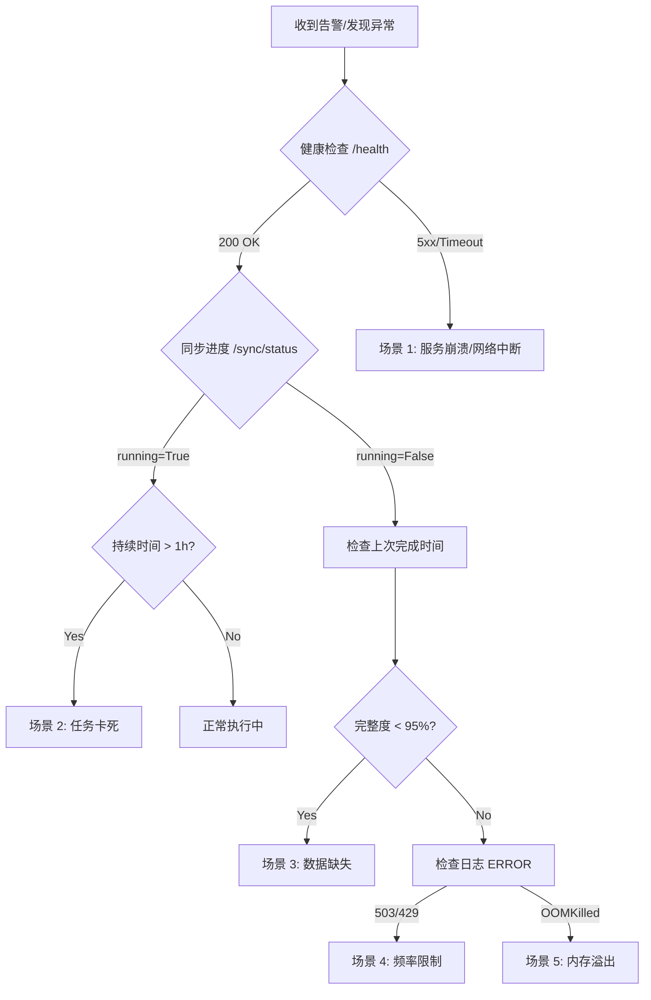

# 故障恢复手册

> **用途**: AI 排查问题时的快速参考

## 故障定位流程



## 场景 1: BaoStock 连接断开

**关键日志**: `Broken pipe`, `Connection reset`, `login failed`
**症状**: 任务中断，日志大量报错，健康检查可能仍通过但功能不可用。

**症状**: 日志 `Broken pipe` 或 `Connection reset`

```bash
# 检查健康
curl http://localhost:8001/health

# 重启服务 (会自动重连+断点续传)
docker compose restart baostock-api
```

---

## 场景 2: 同步任务卡住

**关键日志**: `running=True` (持续长时间), `lock acquired`
**症状**: `running=True` 但进度长时间不变

```bash
# 强制重置
curl -X POST "http://localhost:8001/api/v1/sync/reset"

# 重新触发
curl -X POST "http://localhost:8001/api/v1/sync/full"
```

---

## 场景 3: 数据缺失

**关键日志**: `Completeness check failed`, `rows=0`
**症状**: 完整性校验 < 95%

```bash
# 查看缺失详情
curl "http://localhost:8001/api/v1/sync/verify/daily?date=2026-01-06"

# 触发补偿
curl -X POST "http://localhost:8001/api/v1/sync/remediate?date=2026-01-06&dataType=kline&scope=incremental"
```

---

## 场景 4: PyWencai 频率限制

**关键日志**: `503 Service Unavailable`, `Traffic limit`, `验证码`
**症状**: 连续 503 错误

```bash
# 等待冷却期 (60s)
sleep 60

# 测试
curl -X POST "http://localhost:8002/api/v1/query" -d '{"query": "今日涨停"}'
```

---

## 场景 5: 容器内存溢出

**关键日志**: `Exit Code 137`, `OOMKilled`
**症状**: 容器 OOMKilled

```bash
# 查看内存使用
docker stats --no-stream

# 检查限制
docker compose config | grep memory
```

---

## 通用排查命令

```bash
# 查看所有服务状态
docker compose ps

# 查看特定服务日志
docker compose logs -f baostock-api --tail=100

# 进入容器调试
docker compose exec baostock-api sh
```

---
> **最后更新**: 2026-01-07
