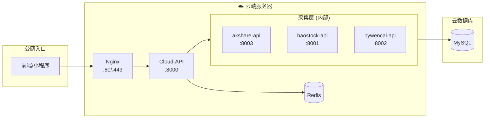

# 02. 云端服务与API (Cloud Services Index)

> **部署位置**: 腾讯云轻量服务器 (2C 4G)
> **核心职责**: 流量入口、数据采集、身份鉴权、任务分发

## 文档导航

本章节已按功能边界拆分为以下子文档：

| 文档 | 聚焦内容 | 关键配置项 |
|:---|:---|:---|
| **[02a_Nginx网关配置.md](./02a_Nginx网关配置.md)** | SSL终结、路由规则、限流、CORS | `nginx.conf` 完整配置 |
| **[02b_Cloud-API聚合层.md](./02b_Cloud-API聚合层.md)** | JWT鉴权、任务分发、Redis交互 | 中间件代码、队列设计 |
| **[02c_数据采集微服务.md](./02c_数据采集微服务.md)** | BaoStock/AkShare/PyWencai | API端点、缓存策略、定时任务 |

---

## 云端服务架构总览

---

## 资源约束提醒

由于云端服务器仅有 **4G 内存**，所有服务必须严格控制资源：

| 服务 | 内存限制 | 备注 |
|:---|:---|:---|
| Nginx | 128MB | 纯转发，无状态 |
| Cloud-API | 800MB | 主业务，连接池控制 |
| Redis | 1.5GB | 缓存+队列 |
| akshare-api | 256MB | 后台任务 |
| baostock-api | 256MB | 后台任务 |
| pywencai-api | 256MB | 按需调用 |
| **合计** | **~3.2GB** | 预留 ~800MB 给系统 |

---

> **下一章**: [03_内网计算引擎.md](./03_内网计算引擎.md)
