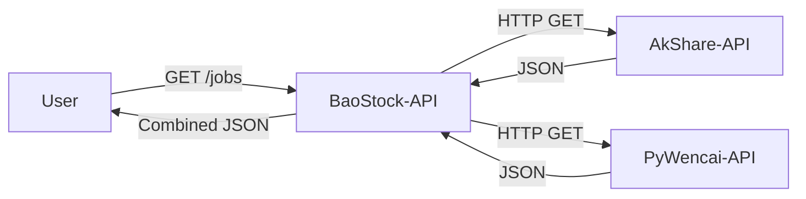

# 02c. 数据采集微服务 (Ingestion Services Spec)

> **部署位置**: 腾讯云轻量服务器 (Docker 容器)
> **职责**: 从外部数据源抓取数据，清洗后写入 MySQL

## 1. 服务总览

这些服务**不对外暴露端口**，仅供 Cloud-API 内部调用或定时任务触发。

| 服务名 | 端口(内部) | 数据源 | 资源限制 | 调用频率 |
|:---|:---|:---|:---|:---|
| `baostock-api` | 8001 | 证券宝 | 256MB | 每日收盘后 |
| `akshare-api` | 8003 | 东方财富/新浪 | 256MB | 按需 + 定时 |
| `pywencai-api` | 8002 | 同花顺问财 | 256MB | 用户触发 |

---

## 2. BaoStock-API (历史数据核心)

### 2.1 服务定位
*   **核心功能**: 全市场 K 线/复权因子同步、估值计算、行业/指数数据。
*   **任务调度器**: 内置 APScheduler，作为整个采集系统的**主控节点 (Aggregator)**，负责聚合管理 AkShare/PyWencai 的定时任务。

### 2.2 完整 API 列表

#### A. K 线与行情 (K-Line)
| Method | Endpoint | Description | Query Params |
|:---|:---|:---|:---|
| GET | `/api/v1/history/kline/{code}` | 获取历史 K 线 | `frequency`, `adjust`, `start_date` |
| POST | `/api/v1/sync/kline/{code}` | 同步个股 K 线 (异步) | `code`, `start_date` |
| POST | `/api/v1/sync/full` | **全市场 K 线同步** | `start_date` (支持断点续传) |

#### B. 复权因子 (Adjust Factor)
| Method | Endpoint | Description | Query Params |
|:---|:---|:---|:---|
| GET | `/api/v1/adjust-factor/{code}` | 获取复权因子 | `start_date` |
| POST | `/api/v1/sync/adjust_factor/{code}`| 同步个股因子 | - |
| POST | `/api/v1/sync/adjust_factor/full` | **全市场因子同步** | `start_date` (智能增量) |

#### C. 数据核验与质量 (DQC/Verify)
| Method | Endpoint | Description | 核心逻辑 |
|:---|:---|:---|:---|
| GET | `/api/v1/sync/verify/daily` | **每日完整性校验** | 对比 `StockList` vs `DB Record Count` |
| GET | `/api/v1/sync/verify/weekly` | 历史同步统计 | 周维度 K 线/因子入库量 |
| GET | `/api/v1/sync/status` | 获取K线同步进度 | 当前处理代码、百分比 |

#### D. 基础数据 (Reference)
| Method | Endpoint | Description |
|:---|:---|:---|
| GET | `/api/v1/index/cons/{code}` | 获取指数成分股 (沪深300等) |
| GET | `/api/v1/index/industry` | 获取行业分类 |
| GET | `/api/v1/valuation/{code}` | 获取 PE/PB/PS 历史与统计分位 |

#### F. 远程修复接口 (Remote Calibration)
> **需求方**: 本地 `get-stockdata` 服务 (数据质量修复)

| Method | Endpoint | Description | Query/Body |
|:---|:---|:---|:---|
| POST | `/api/v1/collect/stock_history` | **个股历史校准** (触发重新采集) | `{stock_code, start_date, clear_existing}` |
| GET | `/api/v1/collect/task/{task_id}` | 查询任务状态 | - |
| POST | `/api/v1/collect/batch` | 批量采集 (P2) | `{stock_codes, start_date}` |
| POST | `(Webhook)` | 回调通知 (可选) | `{task_id, status, records}` |

**实现技术细节**:
*   **服务组件**: 新增 `CollectionService`，专职负责按需修复。
*   **状态追踪**: 采用 **In-Memory LRU Registry** 记录最近 1000 条任务状态 (Pending/Running/Success/Failed)。
    *   *注意*: 服务重启后任务历史会丢失，Client 端应具备重试机制。
*   **数据清洗**: 若请求 `clear_existing=true`，服务将先执行 `DELETE FROM stock_kline_daily WHERE code=...`，再执行采集。
*   **回调机制**: 任务完成后，若请求中包含 `callback_url`，将异步 POST 结果。
*   **日志链路追踪**: 
    *   每个采集任务会接收来自 HTTP 请求的 `request_id` (由 FastAPI 中间件自动生成)。
    *   该 ID 会通过 `extra={"request_id": ...}` 传递给所有日志调用，确保整个任务生命周期的日志可追溯。
    *   示例日志: `{"request_id": "943ea66b", "message": "Task[xxx] 成功: 265 records"}`


### 2.3 核心实现逻辑

#### 2.3.1 智能断点续传 (Resumable Sync)
全市场同步任务（K线/因子）内置了进度持久化机制：
1.  **状态记录**: `sync_progress` 表记录 `last_index` 和 `current_code`。
2.  **崩溃恢复**: 服务重启后，读取 DB 记录，直接跳过已完成的 `last_index` 个股票。
3.  **智能跳过**:
    *   预取 DB 中该股票的 `min_date` 和 `max_date`。
    *   若 `max_date >= today` 且 `min_date <= start_date`，则标记为 `uptodate` 并跳过 API 调用。

#### 2.3.2 批量写入优化 (Batch Buffer)
为了兼容 MySQL 5.7 并提升性能：
*   **Buffer**: 内存中堆积 500 条数据。
*   **Execute**: 使用 `executemany` 一次性提交。
*   **Upsert**: 使用 `ON DUPLICATE KEY UPDATE` 防止主键冲突。

#### 2.3.3 跨容器任务聚合 (Task Aggregator)
BaoStock-API 充当任务管理的中心枢纽：


---

## 3. AkShare-API (实时/基本面)

### 3.1 服务定位
*   **核心职责**: 实时行情快照、财务报表、指数成分股。
*   **特点**: HTTP 协议，响应快，但部分接口有频率限制。

### 3.2 关键 API
| Method | Endpoint | Description | Cache Strategy |
|:---|:---|:---|:---|
| GET | `/api/v1/quote/realtime` | 批量实时行情 | Redis 5s |
| GET | `/api/v1/finance/balance/{code}` | 资产负债表 | Local 24h |
| GET | `/api/v1/index/components` | 指数成分 | Local 1h |

---

## 4. PyWencai-API (NLP选股)

### 4.1 服务定位
*   **核心职责**: 将自然语言查询转换为股票池。
*   **依赖**: `Node.js` 运行时 (执行 JS 逆向)。

### 4.2 API 交互
*   **Endpoint**: `/api/v1/query`
*   **Request**: `{"query": "MACD金叉且放量", "limit": 50}`
*   **Timeout**: 必须在调用端设置 5-10s 超时监控。

---

## 5. 部署资源清单 (Docker)

```yaml
services:
  baostock-api:
    image: python:3.12-slim
    command: uvicorn app.main:app --host 0.0.0.0 --port 8001
    environment:
      - DATABASE_URL=mysql+aiomysql://...
      - SCHEDULER_ENABLED=true  # 开启定时任务
    deploy:
      resources:
        limits:
          memory: 300M

  akshare-api:
    image: python:3.12-slim
    deploy:
      resources:
        limits:
          memory: 300M

  pywencai-api:
    image: wencai-node:latest
    deploy:
      resources:
        limits:
          memory: 512M # Node环境内存占用较大
```
