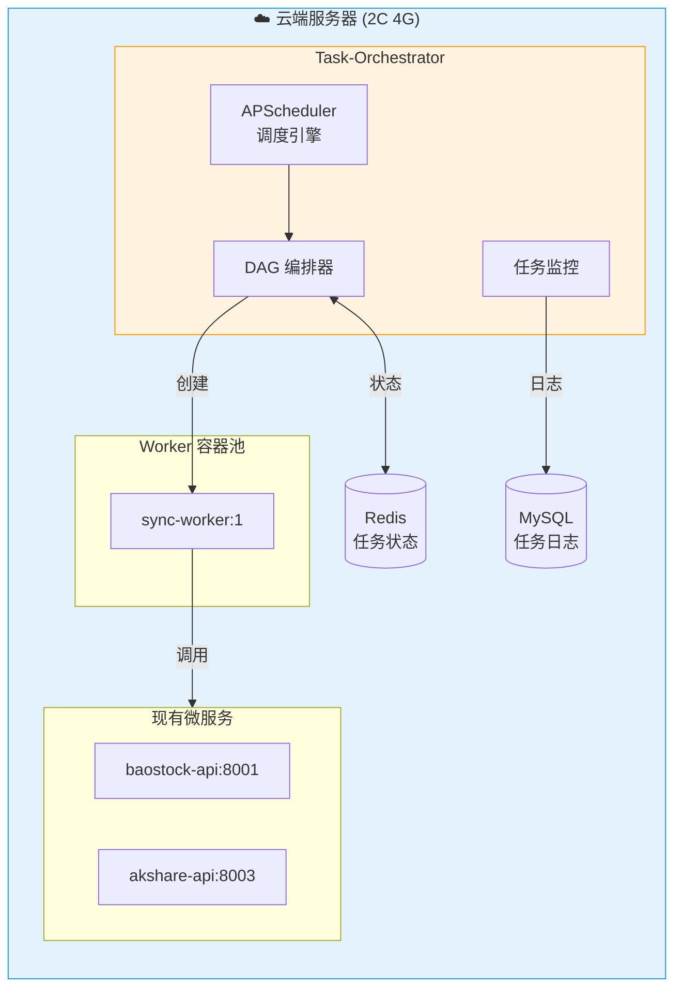
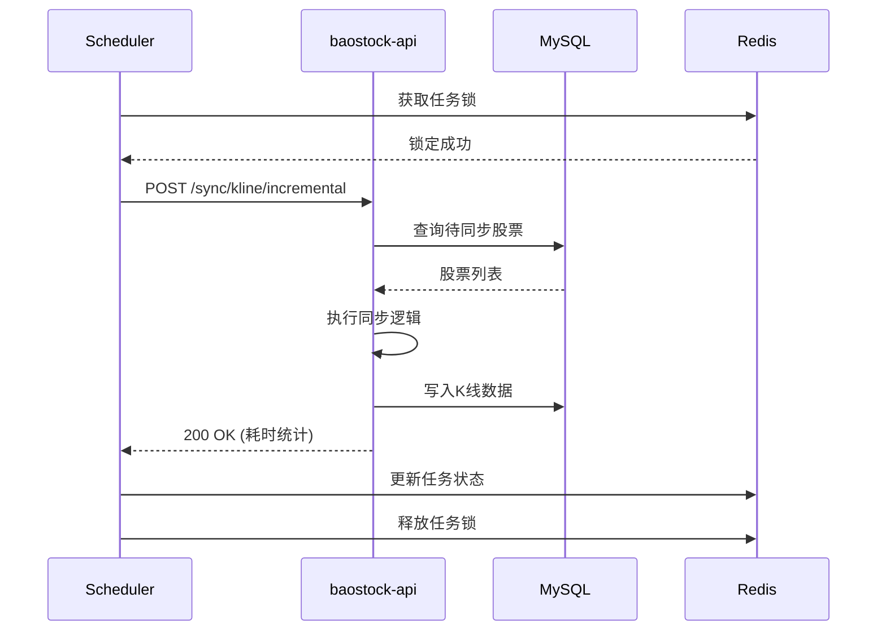

# 02g. Task-Orchestrator 调度系统

> **版本**: 1.1 (已完成 Phase 1 止血)
> **状态**: 实施中
> **日期**: 2026-05-03

## 1. 设计目标

在云端服务器 (2核 4G / 6Mbps) 的严苛资源约束下，构建一个**轻量、可靠、具备交易日感知**的中心化调度系统。

### 1.1 核心原则

| 原则 | 说明 |
|:-----|:-----|
| **中心化调度** | 调度逻辑集中于 `task-orchestrator`，业务服务仅暴露执行端点 |
| **执行器分离** | Orchestrator 负责调度编排，Worker 负责实际执行 |
| **资源约束优先** | 所有设计均需考虑 4GB 内存限制 |
| **渐进式复杂度** | 初期简单实现，预留扩展接口 |

---

## 2. 系统架构

### 2.1 整体拓扑



### 2.2 组件职责

| 组件 | 职责 | 技术选型 | 资源配额 |
|:-----|:-----|:---------|:---------|
| **Scheduler** | 触发任务、管理 Cron 表达式 | APScheduler | 50MB |
| **DAG Engine** | 任务依赖编排、执行顺序控制 | 自研拓扑排序 | 20MB |
| **Worker** | 执行实际数据同步逻辑 | Docker 容器 | 512MB/个 |
| **Monitor** | 任务状态监控、告警 | 日志 + Redis | 30MB |

---

## 3. 核心功能模块

### 3.1 智能拦截与探测机制

#### 3.1.1 交易日门禁 (Calendar Barrier)
通过 `@trading_day_only()` 装饰器，强制所有采集任务在非交易日自动跳过，杜绝无效外部 API 请求。

#### 3.1.2 数据就绪契约 (Readiness Contract)
引入 `meta_data_readiness` 表，实现任务间的解耦。

| 触发器类型 | 实现方式 | 作用 |
|:-----------|:-----|:---------|
| `CalendarService` | 查询 `trade_cal` 表 | 物理隔离非交易日负载 |
| `ReadinessProber` | 扫描 ODS 表记录数 | 确保上游数据就绪后才开启下游计算 |
| `EventTrigger` | Redis Pub/Sub | (Phase 2) 任务间精准实时触发 |

### 3.2 DAG 工作流 (Phase 2)

> **注意**: 初期版本采用简单串行执行，DAG 编排作为 Phase 2 实现。

```yaml
# 未来扩展示例
workflow:
  name: daily_sync
  stages:
    - stage: pre_check
      tasks: [check_data_source, check_db_connection]
    - stage: sync
      tasks: [sync_kline, sync_adjust_factor]
      mode: serial  # 串行执行，节省内存
    - stage: verify
      tasks: [quality_check]
      depends_on: sync
```

### 3.3 任务状态管理

```
状态流转: PENDING → RUNNING → SUCCESS / FAILED

**自愈机制 (Self-Healing)**:
系统定期扫描 `workflow_runs` 和 `task_commands` 表。对于 `RUNNING` 状态超过预设 TTL (如 2小时) 的“僵尸任务”，系统会自动将其标记为 `FAILED`，以释放调度队列并触发告警。
```

**Redis 存储结构**:
```
task:status:{task_id}     → {status, start_time, end_time, error}
task:history:{date}       → [task_id1, task_id2, ...]
task:lock:{task_name}     → {owner, expire_time}
```

---

## 4. 资源约束适配

### 4.1 内存预算分配

| 组件 | 预算 | 说明 |
|:-----|:-----|:-----|
| 现有微服务 (3个) | 768MB | 256MB × 3 |
| Redis | 256MB | 缓存 + 任务状态 |
| Task-Orchestrator | 100MB | 调度器主进程 |
| Worker 容器 | 512MB | **单 Worker 串行** |
| 系统预留 | 400MB | OS + 网络 |
| **总计** | ~2GB | 保留 2GB 余量应对峰值 |

### 4.2 并发控制策略

```yaml
# 云端服务器推荐配置
worker:
  parallelism: 1          # 单 Worker，避免内存溢出
  queue_size: 10          # 任务队列深度
  
resource_limits:
  memory: "512M"          # 硬性限制
  cpus: "0.5"             # 留出 CPU 给其他服务
  
timeout:
  default: 60m            # 串行执行需要更长时间
  kill_after: 65m         # 强制终止超时
```

### 4.3 执行模式对比

| 模式 | 并发数 | 内存占用 | 执行时间 | 推荐场景 |
|:-----|:-------|:---------|:---------|:---------|
| **串行模式** (推荐) | 1 | ~600MB | ~45min | 云端 4GB 服务器 |
| 低并发模式 | 2 | ~1.2GB | ~25min | 扩容至 8GB 后 |
| 分片并行 | 4 | ~2.4GB | ~15min | 内网 64GB 服务器 |

---

## 5. 任务配置示例

### 5.1 每日数据同步任务

```yaml
# config/tasks/daily_sync.yaml
version: "1.0"
timezone: "Asia/Shanghai"

tasks:
  - id: daily_kline_sync
    name: 每日K线数据同步
    
    schedule:
      type: trading_cron        # 仅交易日触发
      expression: "30 18 * * 1-5"  # 周一至周五 18:30
      
    target:
      type: http               # 调用现有 API
      endpoint: "http://baostock-api:8001/api/v1/sync/kline/incremental"
      method: POST
      timeout: 3600            # 1小时超时
      
    error_handling:
      max_retries: 3
      retry_delay: 300         # 5分钟后重试
      on_failure: notify       # 失败时告警
      
    dependencies: []           # 无前置依赖

  - id: daily_adjust_factor_sync
    name: 每日复权因子同步
    
    schedule:
      type: trading_cron
      expression: "00 19 * * 1-5"  # K线完成后 30 分钟
      
    target:
      type: http
      endpoint: "http://baostock-api:8001/api/v1/sync/adjust-factor/incremental"
      method: POST
      timeout: 1800
      
    dependencies:
      - daily_kline_sync       # 依赖 K线同步完成
```

### 5.2 交易日历更新任务

```yaml
  - id: update_trade_calendar
    name: 交易日历年度更新
    
    schedule:
      type: cron
      expression: "0 0 1 1 *"   # 每年1月1日 00:00
      
    target:
      type: http
      endpoint: "http://baostock-api:8001/api/v1/calendar/update"
      method: POST
```

---

## 6. 监控与告警

### 6.1 日志规范

```python
# 所有任务日志必须包含 request_id
{
    "timestamp": "2026-01-03T18:30:00+08:00",
    "level": "INFO",
    "request_id": "task-20260103-001",
    "task_id": "daily_kline_sync",
    "message": "任务开始执行",
    "context": {
        "trigger": "trading_cron",
        "expected_duration": "45m"
    }
}
```

### 6.2 异步邮件告警体系 (Alerter)

基于 `aiosmtplib` 实现了全自动告警分发机制。

| 级别 | 触发场景 | 告警动作 | 期望响应 |
|:-----|:-----|:-----|:-----|
| **WARN** | 单次任务重试成功、探测到部分数据缺失 | 邮件推送 + 防抖 | 次日检查 |
| **ERROR** | 任务最终失败、核心数据 (K线) 缺失 | 邮件推送 + 日志 | 当晚人工介入 |
| **CRITICAL** | 调度进程崩溃、磁盘空间 > 90% | 强力邮件 + 系统报警 | 立即处理 |

**防抖逻辑**: 5 分钟内相同标题的告警仅发送一次，防止邮件轰炸。

---

## 7. 实施路线图

### Phase 1: 基础鲁棒性 (已完成 - 2026-05-03)

- [x] 基于 **APScheduler** 构建云端调度中枢 `stock-manager-api`
- [x] 深度集成 **CalendarService** 实现交易日精准过滤
- [x] 建立 **Readiness Contract** (数据就绪契约)，实现 ODS -> ADS 触发解耦
- [x] 实现 **Alerter** 异步邮件告警体系，支持防抖与分级
- [x] 完成 160+ 僵尸任务状态自愈清理

### Phase 2: 计算任务下沉

- [ ] 部署 **内网计算节点** (stock-compute)，分担云端内存压力
- [ ] 实现跨网数据增量同步与双写回写机制
- [ ] 异动捕捉管线 (8 个 task) 正式落地

### Phase 3: 分布式扩展 (可选)

- [ ] 支持多 Worker 并行
- [ ] 任务分片执行
- [ ] 跨节点调度 (云端 + 内网)

---

## 8. 与现有系统集成

### 8.1 服务交互图



### 8.2 配置文件位置

```
/home/ubuntu/microservice-stock/
├── services/
│   └── baostock-api/
│       └── app/
│           └── scheduler/        # 当前调度器代码
│               ├── scheduler.py
│               └── triggers.py
├── config/
│   └── tasks/                    # 任务配置 (Phase 2)
│       └── daily_sync.yaml
└── docs/
    └── architecture/
        └── 02g_Task-Orchestrator调度系统.md  # 本文档
```

---

> **上一章**: [02c_数据采集微服务.md](./02c_数据采集微服务.md)  
> **下一章**: [03_内网计算引擎.md](./03_内网计算引擎.md)
