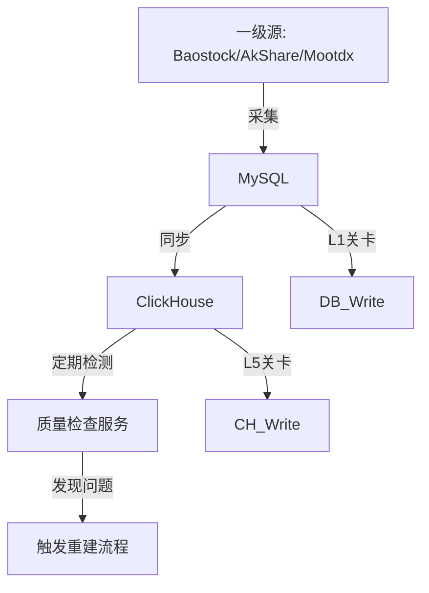

# 04. 风险治理与优化 (Risk Governance & Optimization)

> **核心职责**: 数据质量全生命周期管理 (Data Quality Lifecycle)、高可用容灾。
> **适用场景**: 所有数据写入、存储、应用环节。

## 1. 数据质量全生命周期管理 (Data Quality Lifecycle)

**核心策略**: **"个股数据有任何问题 → 清除 → 重新采集 → 重新同步"**。
系统不做局部修补，只做个股维度的全量重建，以保证数据源头的纯净性。

### 1.1 数据流向与质量关卡



### 1.2 验证层 (Ingestion Guard)

在数据写入时进行实时拦截，防止脏数据污染数据库。

| 层级 | 检查内容 | 失败处理 |
|:---|:---|:---|
| **L1 (字段级)** | 必填字段缺失、价格<0 | 跳过该条 |
| **L5 (逻辑级)** | `High < max(Open, Close)` | 跳过该条 |
| **L7 (集合级)** | 批次内主键重复 | 自动去重 (Keep Last) |

**熔断保护**:
```python
if fail_rate > 0.2:
    raise ValueError("本批次验证失败率过高(>20%)，任务强制终止，请检查源数据")
```

### 1.3 检测层 (Routine Monitor)

通过定时巡检发现静默数据问题。

| 检测项 | 频率 | API | 判定标准 |
|:---|:---|:---|:---|
| **时效性** | 每日 20:00 | `/quality/timeliness` | 最新日期 > T-1 (非节假日) |
| **日完整性** | 每日 20:00 | `/quality/daily-completeness` | 当日入库数 < 前日 95% |
| **个股完整性** | 每周 | `/quality/stock/{code}` | 个股缺失交易日 > 5% |
| **重复数据** | 每日 20:00 | `/quality/duplicates` | `Duplicate Count > 0` |

### 1.4 修复层 (Full Repair)

**唯一策略**: 彻底清除目标数据，触发从源头的重新采集。

#### 修复流程
1.  **Delete**: 清除 ClickHouse 中该股票的所有数据 (`ALTER TABLE ... DELETE`).
2.  **Trigger**: 调用远程采集服务 `POST /api/v1/collect/stock_history` (带 `clear_existing=true` 参数) 重刷 Cloud MySQL。
3.  **Sync**: 采集完成后，触发内网同步任务，从 MySQL 拉回 ClickHouse。

#### 服务职责划分
| 服务 | 角色 | 职责 |
|:---|:---|:---|
| **Cloud-API** (远端) | 执行者 | 负责从 BaoStock/AkShare 重新拉取数据写入 MySQL |
| **Get-StockData** (本地) | 指挥官 | 发现问题 -> 删除本地 -> 指挥远端采集 -> 拉回数据 |

---

## 2. 详细 DQC 实现代码 (Pandas Validator)

```python
import pandas as pd

def validate_dataframe(df: pd.DataFrame) -> pd.DataFrame:
    """
    清洗数据，剔除不合规行，并记录丢弃率
    """
    initial_count = len(df)
    
    # Rule 1: 逻辑校验 (L5)
    valid_logic = (df['high'] >= df[['open', 'close']].max(axis=1)) & \
                  (df['low'] <= df[['open', 'close']].min(axis=1))
    
    # Rule 2: 价格非负 (L1)
    valid_price = (df['open'] > 0) & (df['close'] > 0)
    
    # 综合过滤
    df_clean = df[valid_logic & valid_price]
    
    # 统计丢弃率
    drop_count = initial_count - len(df_clean)
    fail_rate = drop_count / initial_count if initial_count > 0 else 0
    
    if fail_rate > 0.2:
        raise ValueError(f"DQC Error: Too many invalid rows ({fail_rate:.1%})")
        
    return df_clean
```

---

## 3. Lambda 架构：实时与历史融合

解决 ClickHouse 仅存 T-1 数据的痛点，实现**盘中实时回测**。

### 3.1 架构设计
*   **Redis (Hot)**: 用于存储当日实时分钟线/Tick，通过 `Pub/Sub` 实时推入。
*   **ClickHouse (Cold)**: 存储 T-1 及之前的历史归档数据。

### 3.2 融合逻辑 (Data Provider)
```python
def load_data(code):
    # 1. 并行读取
    hist_task = read_clickhouse(code)  # dataframe
    rt_task = read_redis(code)         # list of dict
    
    # 2. 格式转换
    df_hist = await hist_task
    df_rt = pd.DataFrame(await rt_task)
    
    # 3. 合并与去重
    full_df = pd.concat([df_hist, df_rt])
    return full_df.drop_duplicates(subset=['datetime']).sort_values('datetime')
```

---

## 4. 容灾三级兜底 (Disaster Recovery)

针对内网与云端可能的断连，建立**本地文件缓存**。

### 4.1 降级策略
1.  **L1 (Primary)**: 内网 ClickHouse (最快，毫秒级)。
2.  **L2 (Backup)**: 本地 Parquet 文件 (次快，T-1数据，每日凌晨归档)。
3.  **L3 (Fallback)**: 云端 MySQL (最慢，走公网，最后防线)。

---

## 5. 安全防护 (Security)

1.  **云端 Redis**: 必须绑定内网 IP 或使用 `requirepass` 强密码。禁止 bind `0.0.0.0`。
2.  **Cloud-API**: 必须强制 HTTPS。鉴权 Token 有效期不应超过 2 小时。
3.  **内网 Worker**: 容器以非 root 用户运行，限制 CPU/RAM。
