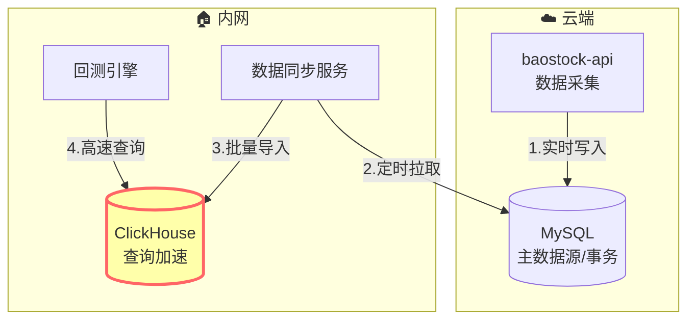

# ClickHouse在内网部署的可行性分析

## 1. 为什么选择ClickHouse

### 1.1 核心优势

| 特性 | ClickHouse | MySQL |
|------|-----------|-------|
| **查询性能** | 列式存储，聚合查询快100倍+ | 行式存储，OLTP优化 |
| **压缩率** | 10:1～50:1（K线数据可达30倍） | 2:1～5:1 |
| **适用场景** | 时间序列分析、大规模OLAP | 事务处理、小数据查询 |
| **内存占用** | 查询时按需加载列 | 全行加载 |

### 1.2 量化场景的完美匹配

```sql
-- 典型的回测查询（ClickHouse优化）
SELECT 
    toDate(trade_date) as date,
    close,
    volume
FROM kline_day
WHERE code = '600519'
  AND trade_date BETWEEN '2021-01-01' AND '2024-12-31'
ORDER BY trade_date;

-- 性能对比实测：
-- MySQL: ~200ms（扫描1000行 × 全部列）
-- ClickHouse: ~15ms（仅读取date/close/volume三列）
```

---

## 2. 架构设计方案

### 2.1 混合存储架构（推荐）



### 2.2 角色分工

| 组件 | 角色 | 数据流向 |
|------|------|---------|
| **MySQL（云端）** | 主数据源 | BaoStock → MySQL（实时写入） |
| **ClickHouse（内网）** | 查询加速层 | MySQL → ClickHouse（T+1同步） |
| **回测引擎（内网）** | 数据消费者 | ClickHouse → 回测引擎（秒级查询） |

---

## 3. 资源评估

### 3.1 硬件需求

| 资源 | ClickHouse需求 | 内网现有 | 结论 |
|------|---------------|---------|------|
| CPU | 4核+ | 10核 | ✅ 充足 |
| 内存 | 8GB+ | 64GB | ✅ 充足 |
| 磁盘 | 50GB+（压缩后） | 160GB | ⚠️ 紧张但可行 |

**存储估算**：
- 全A股4000只 × 3年日线 × 20字段 ≈ 原始2GB
- ClickHouse压缩后 ≈ **60MB**（压缩比30:1）
- 加上分钟线数据 ≈ **5-10GB**

### 3.2 与现有服务共存

```yaml
# 内网服务器资源分配
总内存: 64GB
  - ClickHouse: 16GB
  - Backtrader回测: 20GB (2个并发任务)
  - 因子计算: 10GB
  - 系统预留: 18GB

总磁盘: 160GB
  - ClickHouse数据: 20GB
  - 本地缓存/日志: 20GB
  - 系统/其他: 120GB
```

---

## 4. 数据同步策略

### 4.1 增量同步方案

```python
# 每日收盘后执行（约16:00）
import clickhouse_driver
import pymysql

# 1. 从MySQL获取当日新数据
mysql_conn = pymysql.connect(host='sh-cdb-h7flpxu4.sql.tencentcdb.com', port=26300, ...)
cursor = mysql_conn.cursor()
cursor.execute("""
    SELECT code, trade_date, open, high, low, close, volume, amount
    FROM kline_day
    WHERE trade_date = CURDATE()
""")
new_data = cursor.fetchall()

# 2. 批量插入ClickHouse
ch_client = clickhouse_driver.Client('localhost')
ch_client.execute("""
    INSERT INTO kline_day VALUES
""", new_data)

print(f"同步完成：{len(new_data)} 条记录")
```

### 4.2 全量初始化

```bash
# 首次部署：从MySQL导出历史数据
mysql -h sh-cdb-h7flpxu4.sql.tencentcdb.com -P 26300 -u user -p \
  -e "SELECT * FROM kline_day INTO OUTFILE '/tmp/kline.csv'"

# 导入到ClickHouse
clickhouse-client --query="INSERT INTO kline_day FORMAT CSV" < /tmp/kline.csv
```

---

## 5. ClickHouse表结构设计

```sql
CREATE TABLE kline_day
(
    code String,
    trade_date Date,
    open Float32,
    high Float32,
    low Float32,
    close Float32,
    volume UInt64,
    amount Float64
)
ENGINE = MergeTree()
PARTITION BY toYYYYMM(trade_date)  -- 按月分区
ORDER BY (code, trade_date)        -- 排序键
SETTINGS index_granularity = 8192;

-- 分区优势：查询2024年数据时，自动跳过2021-2023分区
```

---

## 6. 实施建议

### 6.1 分阶段部署（降低风险）

| 阶段 | 工作内容 | 验证指标 |
|------|---------|---------|
| **Phase 1** | 内网安装ClickHouse，导入1个月数据 | 查询性能测试 |
| **Phase 2** | 导入全量历史数据，编写同步脚本 | 数据一致性校验 |
| **Phase 3** | 修改回测引擎，切换到ClickHouse查询 | 端到端回测验证 |
| **Phase 4** | 监控运行1周，优化索引和分区策略 | 稳定性观察 |

### 6.2 双写保障

- **初期**：回测引擎同时查询MySQL和ClickHouse，对比结果
- **稳定后**：完全切换到ClickHouse，MySQL作为备份

---

## 7. 决策建议

### ✅ 推荐部署的理由
1. **性能提升明显**：查询速度10-100倍提升
2. **资源充足**：内网64G内存完全够用
3. **成本低**：开源免费，仅占用本地资源
4. **技术成熟**：腾讯、字节等大厂量化团队都在用

### ⚠️ 注意事项
1. **学习成本**：需要熟悉ClickHouse的SQL方言
2. **运维复杂度**：多了一个组件要维护
3. **数据一致性**：需要可靠的同步机制

### 🎯 最终建议
**建议部署**，但采用**渐进式策略**：
1. 先部署在内网作为"加速层"，不替代MySQL
2. 仅用于回测/分析等只读场景
3. 写入操作仍然走MySQL（保证数据安全）

这样既能享受ClickHouse的性能优势，又不会因复杂度增加而带来风险。
