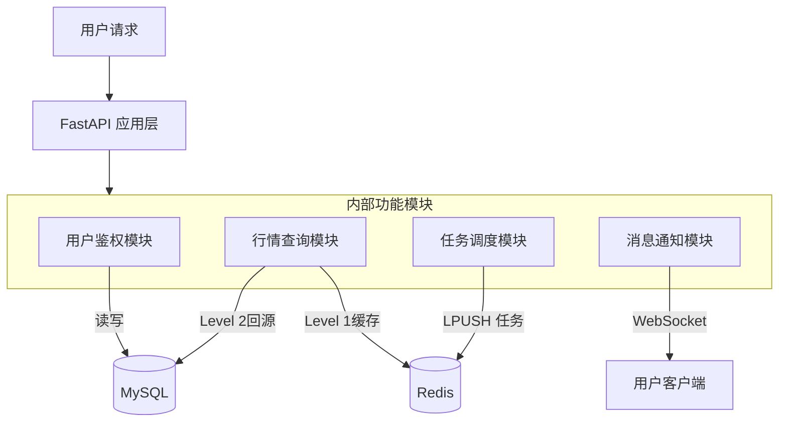

# 腾讯云轻量服务器 (2C 4G) 详细架构设计

## 1. 定位与核心职责
在混合云架构中，这台服务器是**唯一的公网业务入口**。它不负责繁重的计算，专注于**高并发IO、流量分发、状态管理**。

*   **对外 (To User)**: 提供 HTTPS API、WebSocket 推送、静态资源托管。
*   **对内 (To Internal Server)**: 提供任务队列 (Redis)、接收心跳上报。
*   **对数据 (To DB)**: 承担读多写少的查询压力，对热点数据进行缓存。

---

## 2. 软件栈与容器规划 (Docker Compose)

考虑到 4G 内存限制，我们需要精细控制每个容器的资源配额。

| 服务名称 | 镜像/技术 | 端口 | 内存限制 | 职责 |
|:---|:---|:---|:---|:---|
| **gateway-nginx** | `nginx:alpine` | 80/443 | 128MB | 反向代理、SSL终结、以及**前端静态文件托管** |
| **cloud-api** | `python:3.12-slim` (FastAPI) | 8000 | 800MB | 核心业务逻辑、权限校验、Redis/MySQL交互 |
| **redis-broker** | `redis:7-alpine` | 6379 | 1.5GB | 消息队列、Session存储、行情快照缓存 |
| **monitor-agent** | `glances` / `node-exporter` | 9100 | 100MB | 轻量级系统监控 |

*   **预留系统内存**: ~1.5GB (OS内核 + 文件系统缓存 + 突发缓冲)

---

## 3. 功能模块详细设计 (cloud-api)

这是云端运行的核心 Python 服务，建议整合为一个单体服务以节省资源，而非拆分为微服务。

### 3.1 模块划分



### 3.2 关键业务逻辑

#### A. 行情数据服务 (Market Service)
*   **读策略 (Read-Through)**:
    1.  用户请求 `GET /api/v1/stock/kline/600519`。
    2.  检查 Redis `kline:600519:day` 是否存在。
    3.  **Hit**: 直接返回 Redis 数据 (耗时 < 5ms)。
    4.  **Miss**: 查询 MySQL，序列化返回，并写入 Redis (设置 TTL 1分钟-1小时不等)。
*   **写策略**:
    *   云端 API **不负责** 写入行情数据。
    *   行情数据由**内网服务器**清洗后直接写入 MySQL。

#### B. 策略任务调度 (Task Dispatcher)
*   **双向通信机制**:
    1.  **提交**: 用户 POST 策略参数 -> 写入 Redis List `queue:backtest`。
    2.  **状态**: 用户轮询/订阅 -> 读取 Redis Hash `task:status:{id}`。
    3.  **结果**: 仅返回摘要(收益率、最大回撤)，详细交割单可生成 Signed URL 指向相关存储(如果文件很大)或分页查询 MySQL。

#### C. 用户鉴权 (Security)
*   使用 **OAuth2 + JWT (RS256)**。
    *   Token 签发在云端完成。
    *   Token 包含 `user_id`, `role`, `expire`。
    *   无状态认证，极大降低内存占用（无需在内存维护 Session 表）。

---

## 4. 存储层设计：Redis 使用规范

由于内存宝贵，Redis 的使用必须极度克制：

1.  **配置限制**: `maxmemory 1.5gb`, `maxmemory-policy allkeys-lru`。
2.  **Key命名空间**:
    *   `mkt:{code}` - 行情快照 (Hash)
    *   `job:q` - 任务队列 (List)
    *   `job:res:{id}` - 任务结果 (String, TTL 30分钟)
    *   `usr:lmt:{id}` - API限流计数器
3.  **安全性 (关键)**:
    *   由于内网服务器需要通过公网连接此 Redis，必须开启 `requirepass`。
    *   **强烈建议**: 使用 SSH Tunnel 或 Stunnel 封装 Redis 流量，防止公网嗅探。

---

## 5. Nginx 网关配置策略

Nginx 作为守门人，需配置以下功能保护后端 `cloud-api`：

1.  **静态资源分离**:
    *   `/api/` -> `proxy_pass http://cloud-api:8000`
    *   `/ws/` -> WebSocket 升级支持
    *   `/` -> `root /usr/share/nginx/html` (前端构建包)
2.  **Gzip 压缩**: 开启 `gzip on`，显著减少 JSON 传输流量（行情数据压缩率极高）。
3.  **限流 (Rate Limit)**: 针对 IP 限制 `/api/` 请求频率（如 10r/s），防止恶意刷接口消耗 CPU。

---

## 6. 部署与维护

### 目录结构建议
```
~/cloud-server/
├── docker-compose.yml
├── nginx/
│   ├── conf.d/
│   │   └── app.conf      # 反向代理配置
│   └── dist/             # 前端构建产物 (dist)
├── cloud-api/            # Python后端代码
│   ├── Dockerfile
│   └── app/
└── .env                  # 包含 MySQL连接串, Redis密码
```

### 资源监控预警
在 `cloud-api` 中加一个简单的定时任务，每分钟检查一次系统负载，如果 RAM > 90%，触发报警（发送消息到您的微信）。

