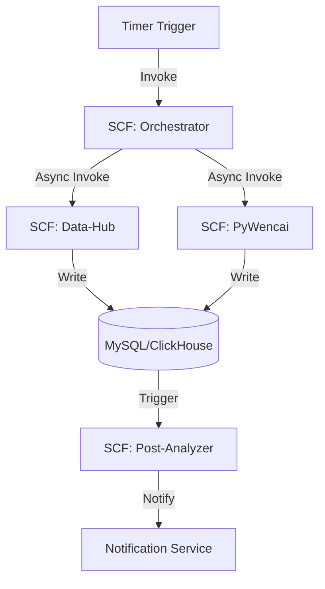

# Stock-Serverless-Collector 项目 PRD (Product Requirements Document)

## 1. 项目概述

### 1.1 项目背景
本项目是基于原有的 `microservice-stock` 进行的 Serverless 原生化重构。原项目采用 Docker Compose 部署，虽然功能完备，但在腾讯云环境下面临运维复杂度高、闲置资源浪费、扩缩容不灵活等问题。

### 1.2 核心目标
- **Cloud-Native**: 深度集成腾讯云 SCF、API Gateway、CLS 和 TDMQ。
- **Zero-Cost (Target)**: 利用 SCF 免费额度，将日均采集成本降低至极低水平。
- **High Reliability**: 通过云函数重试机制、DLQ（死信队列）和自动化监控确保采集任务不遗漏。
- **Modular Design**: 插件化支持 AkShare、BaoStock、Tushare 等多种数据源。

## 2. 角色与场景

### 2.1 目标用户
- 量化投资者（数据采集与初筛）。
- 金融 UI 开发者（通过 API 获取数据）。
- 自动化运维系统（数据就绪探测与同步）。

### 2.2 典型场景
- **每日盘后采集**: 15:30 自动触发，采集行情、指标及异动数据。
- **历史数据回补**: 通过手动触发 API，指定日期区间回补历史 K 线。
- **实时指标计算**: 数据写入数据库后，触发计算函数更新 ADS 层指标。

## 3. 功能需求

### 3.1 采集层 (Collectors)
- **Data-Hub SCF**: 
  - 集成 AkShare (K 线、龙虎榜)。
  - 集成 BaoStock (基础信息、复权因子)。
  - 集成 Tushare (P0 级核心数据)。
  - 自动切换数据源以应对流控。
- **PyWencai SCF**:
  - 独立运行环境（512MB 内存）。
  - 处理问财语义化查询（如：今日涨停且封单量大于1000万）。

### 3.2 任务编排与调度 (Orchestration)
- **SCF Timer Trigger**: 负责触发每日固定频率的任务。
- **ASL (Tencent Cloud Step Functions)** (可选/二期): 负责复杂的工作流管理（如：A 采集完后触发 B 校验，再触发 C 计算）。

### 3.3 数据存储 (Persistence)
- **Metadata Management**: 记录采集状态、错误日志、任务耗时。
- **Idempotency Check**: 采集前检查 `ods_` 表，避免重复写入。
- **Data Retention**: 自动清理 30 天前的临时/日志数据。

### 3.4 监控与告警
- **CLS Integration**: 所有函数日志统一流入日志服务。
- **Health Check**: 提供 `/health` 接口，并由云拨测监控。
- **Notification**: 任务失败通过微信企业助手或邮件告警。

## 4. 技术架构 (Technical Architecture)

### 4.1 架构图 (Mermaid)

### 4.2 部署规范
- **Runtime**: Python 3.10。
- **Deployment Tool**: Serverless Framework (`serverless.yml`)。
- **VPC**: 关联腾讯云私有网络，与数据库内网互通。

## 5. 非功能性需求

### 5.1 性能要求
- **冷启动响应**: 核心 Data-Hub 首次启动耗时 < 3s。
- **任务超时**: 单次采集任务最大运行时间设为 900s (15min)。

### 5.2 安全性
- **Environment Secrets**: 敏感 Key (Tushare Token) 严禁明文存放在代码，必须使用云函数环境变量加密存储。
- **Internal Access**: 数据库仅限 VPC 内网访问。

### 5.3 扩展性
- **Schema-less Config**: 采集任务参数（如代码列表、日期范围）通过 JSON 动态下发。

## 6. 演进路线

1. **Phase 1 (MVP)**: 迁移 Data-Hub 核心逻辑，实现盘后 K 线自动入库。
2. **Phase 2 (Reliability)**: 引入 TDMQ 消息队列和状态审计表。
3. **Phase 3 (Optimization)**: 极致成本优化，使用 SCF 层剥离静态库，开启「预置并发」。

---
*Created by Antigravity AI - 2026-05-11*
