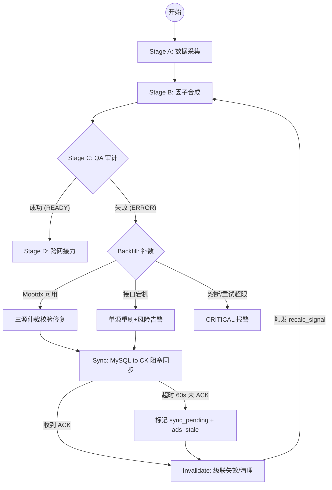

# [PRD] A 股数据管线自愈系统 (Tencent Cloud MySQL 侧)
_副标题：本方案聚焦 MySQL 侧自愈；CK 侧重算与跨网同步通道详见《ClickHouse 数据同步契约》_

| 版本 | 日期 | 状态 | 修改人 | 摘要 |
| :--- | :--- | :--- | :--- | :--- |
| v1.5 | 2026-05-10 | **已定稿 (生产级)** | Antigravity | 引入 Mootdx-API (通达信协议) 替代已失效的 BaoStock，恢复三源仲裁体系 |

---

## 1. 业务愿景与 SLA

本系统旨在建立一套高度自动化的数据治理闭环，将人工干预率控制在 **≤ 0.5% (按交易日修复条目计)**。
遵循以下最高准则：
1. **字段级校验路径**：根据字段特性选择最优校验方式，不搞一刀切。
2. **数据一致性 (MySQL ↔ CK ↔ ADS)**：通过双重确认位点确保全链路数据对齐。
3. **操作必可撤销**：所有自动修复必须具备物理级的原子回滚能力。

---

## 2. [P0] 核心自愈闭环逻辑

### 2.1 业务流程全景 (The Healing Loop)

### 2.2 差异化校验矩阵 (字段级路径)

| # | 字段类型 | 代表对象 | 校验路径 | 数据源独立性 | 阈值/规则 |
|---|---|---|---|---|---|
| 1 | **行情 K 线** | `stock_kline_daily` OHLCV | **三源仲裁** (取二一致) | **Tushare + Mootdx + AkShare** (物理隔离通道) | 允许 0.01% 的浮点数截断误差; 成交额允许 0.1% 差异 |
| 2 | **复权因子** | `stock_adjust_factor` | **双源校验** | Tushare + Mootdx | 校验公式: `h_factor[t] >= h_factor[t-1]` (除非发生除权) |
| 3 | **派生指标** | `daily_basic` (PE/PB/市值) | **公式重算**(不跨源) | Tushare 单源 | 必须使用 `(close * float_share)` 实时重算，不信任 ODS 原始字段 |
| 4 | **财务数据** | `fin_income / balance` | 单源 + 三表勾稽 | Tushare | `资产 = 负债 + 所有者权益` 勾稽失败则强制重拉原始报表 |
| 5 | **元数据** | `trade_cal`, `ods_st_change` | 强一致校验 | 交易所官方数据 | 任何偏差直接报 ERROR，禁止自动修复以防逻辑链崩塌 |

---

## 2.3 级联失效逻辑 (Stage G)

当 `stock_kline_daily` 或 `stock_adjust_factor` 发生修复后，系统必须强制清理/重算以下 ADS 视图：
1. **ADS_KLINE_ADJ**: 所有的前/后复权 K 线必须重算（基于最新的 `adj_factor`）。
2. **ADS_INDICATOR_MA**: 所有均线（MA5/10/20）和 MACD 指标标记失效。
3. **ADS_STRATEGY_SIGNAL**: 所有的买入/卖出信号需在 UI 端标记 "Data Fixed - Re-validating"。

---

## 2.4 同步与回滚增强 (Reliability)

**阻塞同步 + 超时降级 (Stage F)**
*   **ACK 定义**: 腾讯云同步网关返回 `commit_lsn` 确认位点。
*   **降级逻辑**: 若 60s 未收到 ACK，MySQL 侧数据判定为“孤儿状态”，CK 侧读取时必须检测 `meta_sync_status`。

**原子回滚机制**
*   **存储**: `meta_repair_log` 记录修复前的镜像 (JSON 格式)。
*   **指令**: 调用 `api/v1/repair/rollback/{task_id}` 实现 100% 物理还原。

---

## 3. [P1] 数据治理与白名单

### 3.1 白名单全生命周期
*   **双人审批**: 任何手动加入白名单的行为需在 `implementation_logs` 存证。
*   **强制过期**: 系统每日 09:00 扫描白名单，过期的 `expire_at` 记录将自动逻辑删除。

---

## 4. 验收标准 (Acceptance Criteria)

### AC-1: 修复正确性 (三源仲裁)
- **Given**: Tushare 侧 `close` 为 10.0，数据库中为 9.0，Mootdx 侧为 10.0。
- **When**: 触发自愈扫描。
- **Then**: 数据库字段更新为 10.0 (取二一致)，且 `meta_repair_log` 生成记录。

### AC-2: 级联同步
- **Given**: 修复了 600519.SH 的历史 K 线。
- **Then**: 腾讯云 ClickHouse 端的相应行在 5 分钟内完成更新（Checksum 对齐）。

---

## 5. 系统风险与防御
*   **协议解析风险**: Mootdx 基于二进制协议，需关注行情服务器 (TDX) 的连通性与负载均衡。
*   **自愈总开关**: `meta_self_heal_enabled = false` (用于盘中紧急避险)。

