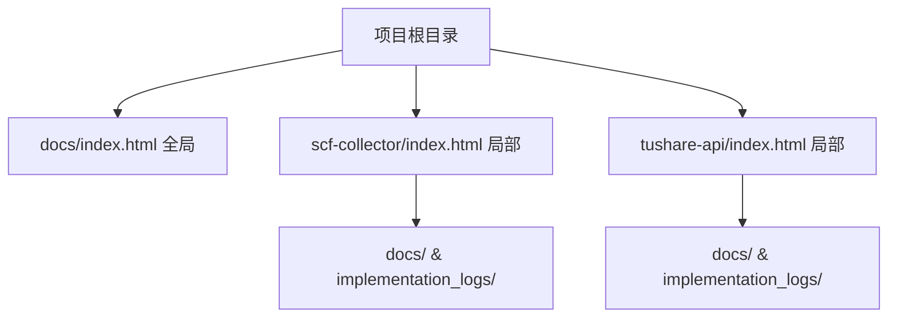

# Epic E10: 开发者体验增强：双级文档门户与 SOP 自动化闭环

> **Version**: v1.0  
> **Date**: 2026-05-15  
> **Status**: Draft

## 1. 背景

随着微服务数量的增加，全局文档门户（`docs/index.html`）逐渐变得拥挤，难以快速定位特定服务的实施细节。同时，Epic -> Story -> Task -> AC 的开发流程虽然已经明确，但缺乏自动化的工具链支撑，导致文档更新滞后或格式不统一。本 Epic 旨在通过建立“全局+局部”的双级门户体系，并将 SOP 流程自动化，提升开发与审计效率。

## 2. 架构方案

建立双级索引结构，实现文档的“垂直深挖”与“水平发现”：

| 层级 | 路径 | 职责 |
|---|---|---|
| **全局门户** | `docs/index.html` | 展示全项目子系统导航及全局最新动态 |
| **局部门户** | `{service}/index.html` | 展示特定服务的 Epic 设计、评审记录及实施报告 |

### 2.1 目录结构示意

---

## 3. Epic 拆解

### E10-S1: 门户脚本重构与双级扫描实现
**角色**: DevOps Engineer  
**需求**: 一个能够自动扫描全项目 HTML 并生成全局/局部索引的脚本。  
**价值**: 消除手动维护文档索引的成本，确保文档 100% 可发现。

#### 任务
- [ ] **E10-S1-T1**: 编写/更新 `scripts/update_docs_portal.py`，支持递归扫描各微服务 `docs` 目录
- [ ] **E10-S1-T2**: 实现局部 `index.html` 生成逻辑，根据所在服务目录动态过滤内容
- [ ] **E10-S1-T3**: 集成相对路径计算模块，解决不同层级间的跳转问题

#### 验收标准 (AC)
- **AC1 (全局扫描能力)**: 
  - **Given**: 存在多个包含 `docs/` 的微服务目录
  - **When**: 执行 `python scripts/update_docs_portal.py`
  - **Then**: `docs/index.html` 能正确列出所有服务的最新 5 条 HTML 记录
- **AC2 (局部索引生成)**: 
  - **Given**: `scf-collector` 目录下有多个实施报告
  - **When**: 脚本运行结束
  - **Then**: `scf-collector/index.html` 被创建，且仅包含该服务的文档

---

### E10-S2: 门户模板标准化与视觉一致性
**角色**: Frontend Designer  
**需求**: 一套统一的 HTML 模板，支持全局和局部索引的渲染。  
**价值**: 提升项目专业感，确保导航体验一致。

#### 任务
- [ ] **E10-S2-T1**: 抽取现有的 `docs/index.html` 样式为独立 CSS 或 Jinja2 模板片段
- [ ] **E10-S2-T2**: 设计局部门户专用布局（突出该服务的 Epic 列表）

#### 验收标准 (AC)
- **AC1 (视觉一致性)**: 
  - **Given**: 生成了全局和局部门户
  - **When**: 浏览器打开
  - **Then**: 两者配色、字体、卡片风格完全一致

---

### E10-S3: SOP 流程准则入规
**角色**: Requirement Architect  
**需求**: 更新 `AGENTS.md` 和技能文档，将双级门户和 Epic 评审循环固化为硬约束。  
**价值**: 确保后续所有开发活动都遵循标准流程，维持项目长期可维护性。

#### 任务
- [ ] **E10-S3-T1**: 更新 `AGENTS.md` 增加 5.5 节 Epic Audit Loop
- [ ] **E10-S3-T2**: 更新 `epic-story-doc/SKILL.md`，明确 MD/JSON 双轨制与门户集成的要求

#### 验收标准 (AC)
- **AC1 (规则覆盖)**: 
  - **Given**: 查看 `AGENTS.md`
  - **When**: 搜索 `Portal` 或 `Audit`
  - **Then**: 必须能看到明确的自动化执行指令（如脚本运行命令）

---

## 4. 风险管理

| 风险描述 | 影响 | 概率 | 缓解措施 |
|---|---|---|---|
| 相对路径陷阱 | 中 | 中 | 在脚本中使用统一的相对路径计算逻辑，确保 HTML 静态跳转不失效。 |
| 脚本执行权限 | 低 | 低 | 确保脚本在 Docker 和本地环境下均可执行。 |

## 5. 里程碑 (Milestones)

- **M1: 核心脚本就绪** (2026-05-15): `update_docs_portal.py` 支持双级扫描
- **M2: 门户全量覆盖** (2026-05-15): 各微服务根目录 `index.html` 生成
- **M3: SOP 准则固化** (2026-05-15): `AGENTS.md` 更新完成
