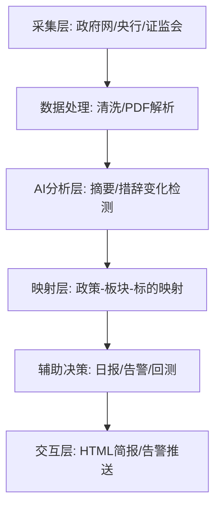

# Epic 14: AI-Driven Policy Tracking System (MVP)

## 背景
建立一个基于 AI 的政策跟踪系统，解决投资者在处理海量宏观政策信息时的「预警、追踪、对比、映射、日历」五大核心痛点。

## 核心技术栈与环境约束
| 组件 | 技术选型 | 备注 |
|---|---|---|
| 语言 | Python 3.10+ | 兼容 SCF 运行环境 |
| LLM | DeepSeek / Claude (API) | SCF 通过 API 请求大模型，不进行本地推理 |
| 存储 | Tencent Cloud MySQL | 强制要求使用腾讯云数据库，弃用本地存储 |
| 抓取 | RSS + BeautifulSoup | RSS 逻辑集成在 scf-collector 中，无需独立部署 |
| 环境 | Tencent SCF | 受限只读环境，需处理好依赖层打包 |

> [!NOTE]
> **架构设计准则**：
> 1. **SCF 兼容性**：所有采集逻辑必须在 600s 阈值内完成，避免函数超时。
> 2. **数据隔离**：本地 `/tmp` 仅用于中间解析，最终态必须落库 MySQL。
> 3. **Prompt 管理**：通过外部配置文件管理 Prompt 模板，支持在线动态更新。

## 风险评估
| 风险 | 影响 | 可能性 | 应对措施 |
|---|---|---|---|
| 政府网站反爬 | 高 | 中 | 优先使用 RSS 订阅，控制频率 > 30min，引入 MD5 去重。 |
| LLM 幻觉 | 中 | 高 | 保留原文链接，5星政策强制人工核对。 |
| SCF 磁盘受限 | 中 | 中 | 所有 PDF 解析完成后立即清理 `/tmp` 临时目录。 |

## 里程碑
- **M1: 采集与分析闭环** (2026-05-30): 实现政府网/央行采集，自动生成政策日报。
- **M2: 措辞对比与回测** (2026-06-15): 实现历史政策库回测，建立核心议题强度告警。

---

## E14 AI-Driven Policy Tracking System (MVP)

交付一套基于腾讯云 SCF 的全自动政策监控与分析系统。

### E14-S1 数据采集层建设 (Data Acquisition)
**角色**: scf-collector
**目标**: 实现对政府网、央行、证监会等权威源的自动化监控
**价值**: 获得一手政策情报

#### 任务
- [ ] T1: 实现中国政府网 (gov.cn/zhengce) 政策文件的抓取适配器
- [ ] T2: 设计定时扫描逻辑：默认 30min/次，处理重复抓取（MD5 摘要对比）
- [ ] T3: 实现采集完整性探针：自动检测采集漏项并触发重试

#### 验收标准 (AC)
##### AC1 采集覆盖度验证
- **Given**: 系统运行在采集模式
- **When**: 访问核心机构页面
- **Then**: 能够准确解析出「标题、发布时间、发文机构、原文链接、正文内容」

##### AC2 去重逻辑验证
- **Given**: 已存在相同 MD5 的政策记录
- **When**: 再次触发抓取
- **Then**: 数据库不会产生重复记录，日志显示 'Skip existing policy'

---

### E14-S2 AI 分析层与措辞对比 (AI Intelligence)
**角色**: AI Analyzer
**目标**: 完善 Prompt 体系以覆盖摘要、措辞、影响评估等场景
**价值**: 快速提炼核心增量信息

#### 任务
- [ ] T1: 建立 Prompt 模板库，包含：通用摘要、货币政策对比、产业扶持评估等 5+ 场景
- [ ] T2: 集成 LLM API 流水线，支持异步并发请求与自动重试

#### 验收标准 (AC)
##### AC1 场景化 Prompt 验证
- **Given**: 输入一篇货币政策会议纪要
- **When**: 指定场景为 'monetary_policy'
- **Then**: 输出包含「利率/准备金率表述变化」的对比分析

##### AC2 输出结构化验证
- **Given**: LLM 返回分析内容
- **When**: 解析 JSON 响应
- **Then**: 能够提取出「重要性星级、板块关键词、核心结论」三个关键字段

---

### E14-S3 知识库与板块映射 (Mapping & Storage)
**角色**: Data Architect
**目标**: 基于腾讯云 MySQL 建立政策-申万板块映射关系
**价值**: 进行回测和持仓影响分析

#### 任务
- [ ] T1: 在腾讯云 MySQL 初始化 `ods_policy_info` 与 `dwd_sector_mapping` 表
- [ ] T2: 建立申万 31 个一级行业的关键词词库映射

#### 验收标准 (AC)
##### AC1 MySQL 持久化验证
- **Given**: 采集到新政策
- **When**: 执行 INSERT 操作
- **Then**: 数据成功存入 Tencent Cloud MySQL，字符集为 utf8mb4

##### AC2 自动映射准确性
- **Given**: 政策提及「白酒、家电」
- **When**: 运行映射逻辑
- **Then**: 返回正确的「食品饮料、家用电器」行业 ID

---

### E14-S4 辅助决策与交互 (Reporting)
**角色**: Investment Advisor
**目标**: 自动生成每日简报并对持仓影响评分
**价值**: 辅助最终投资决策

#### 任务
- [ ] T1: 开发 HTML 版每日政策简报模板，适应手机端阅读
- [ ] T2: 实现高星级政策的实时 WX 推送逻辑

#### 验收标准 (AC)
##### AC1 简报完整性
- **Given**: 当日有新政策
- **When**: 生成简报
- **Then**: 内容覆盖「今日要闻、板块异动、专家解读」三部分

##### AC2 告警及时性
- **Given**: 发现 5 星级重大政策
- **When**: 采集后 60s 内
- **Then**: 成功触发并发送微信预警

---

## 变更记录
| 日期 | 版本 | 说明 |
|---|---|---|
| 2026-05-15 | v1.0 | 初始方案设计 |
| 2026-05-16 | v1.1 | **评审后调整**：切换至 Tencent Cloud MySQL；适配 SCF Python 3.10 环境；增强 S1 采集去重与频控细节；完善 S2 多场景 Prompt 体系。 |
