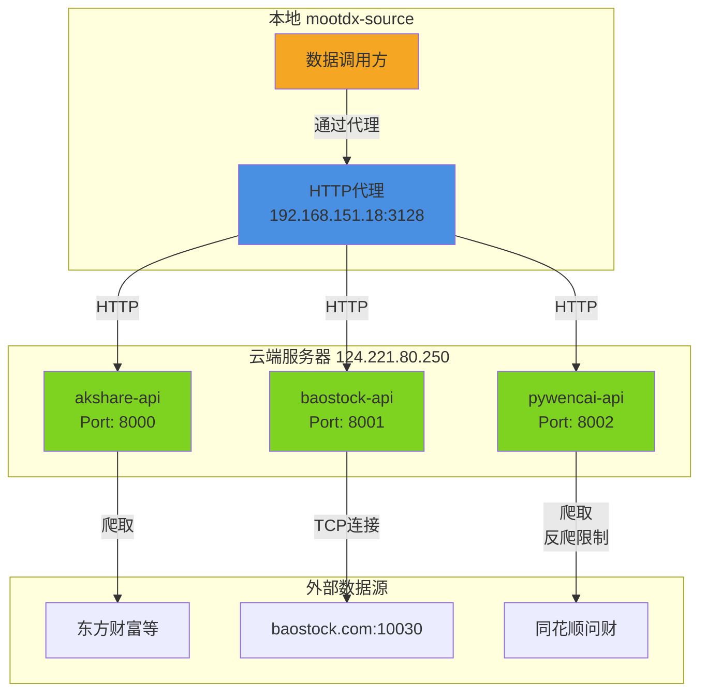
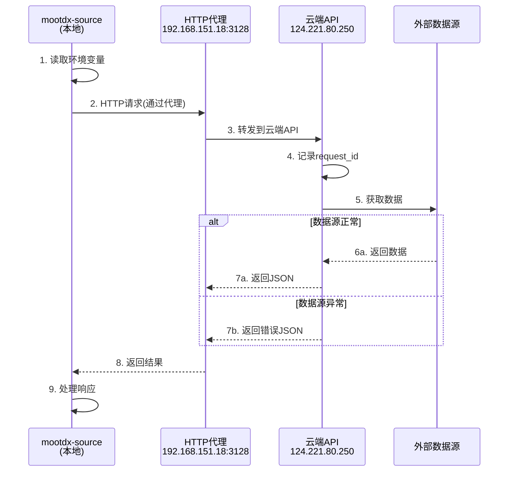

# 股票数据源微服务架构设计

## 1. 架构概述

本系统采用微服务架构，将不同的股票数据源封装为独立的Docker容器服务，通过API网关统一对外提供服务。

### 1.1 核心设计原则

- **服务独立性**: 每个数据源独立部署，互不影响
- **容器化**: 所有服务使用Docker容器化，便于部署和扩展
- **统一接口**: 通过API网关提供统一的RESTful API
- **高可用**: 支持服务的水平扩展和故障隔离
- **可观测性**: 集成日志、监控和链路追踪

## 2. 系统架构图



## 3. 微服务详细设计

### 3.1 akshare-api (:8000)

**数据源**: 东方财富等多个数据源

**核心功能**:
- 财务报表数据
- 估值指标(PE/PB/PS)
- 历史估值数据
- 龙虎榜数据
- 个股行业分类
- 热门排行榜

**API端点**:

| 端点 | 方法 | 功能 | 参数 |
|------|------|------|------|
| `/api/v1/finance/{code}` | GET | 财务报表 | code=600519 |
| `/api/v1/valuation/{code}` | GET | 估值指标 | code=600519 |
| `/api/v1/valuation/{code}/history` | GET | 历史估值 | start_date, end_date |
| `/api/v1/dragon_tiger/daily` | GET | 龙虎榜 | date=2024-01-15 |
| `/api/v1/industry/stock/{code}` | GET | 个股行业 | code=600519 |
| `/api/v1/rank/hot` | GET | 热门排行 | limit=50 |

**技术栈**:
- Python 3.12
- FastAPI框架
- akshare库
- Alpine基础镜像

**资源限制**: 内存≤128MB

**响应示例**:
```json
{
  "code": "600519",
  "total_revenue": 150000000000,
  "net_profit": 75000000000,
  "roe": 0.32,
  "report_date": "2024-09-30"
}
```

---

### 3.2 baostock-api (:8001)

**数据源**: baostock.com:10030 (TCP连接)

**核心功能**:
- 历史K线数据(前复权/后复权)
- 指数成分股
- 行业分类
- 盈利能力指标

**API端点**:

| 端点 | 方法 | 功能 | 参数 |
|------|------|------|------|
| `/api/v1/history/kline/{code}` | GET | 历史K线 | frequency=d, adjust=2 |
| `/api/v1/index/cons/{index}` | GET | 指数成分 | index=sz.399300 |
| `/api/v1/industry/classify` | GET | 行业分类 | - |
| `/api/v1/finance/profit/{code}` | GET | 盈利能力 | code=sh.600519 |

**关键参数**:
- `adjust`: 1=后复权, 2=前复权, 3=不复权
- `frequency`: d=日线, w=周线, m=月线, 5=5分钟

**技术栈**:
- Python 3.12
- FastAPI框架
- baostock库
- Alpine基础镜像

**资源限制**: 内存≤128MB

**响应示例**:
```json
[{
  "date": "2024-01-15",
  "open": 1680.00,
  "high": 1699.50,
  "low": 1675.00,
  "close": 1695.00,
  "volume": 1234567,
  "amount": 2098765432,
  "turn": 0.12,
  "pctChg": 1.25
}]
```

---

### 3.3 pywencai-api (:8002)

**数据源**: 同花顺问财

**核心功能**:
- 自然语言选股
- 热门板块数据

**API端点**:

| 端点 | 方法 | 功能 | 参数 |
|------|------|------|------|
| `/api/v1/query` | POST | 自然语言查询 | q="今日涨停" |
| `/api/v1/sector/hot` | GET | 热门板块 | - |

**技术栈**:
- Python 3.12
- FastAPI框架
- pywencai库
- Alpine基础镜像

**资源限制**: 内存≤128MB

**特殊注意**:
- ⚠️ 反爬限制严格,需处理验证码
- ⚠️ 预期失败率约30%
- ⚠️ 频率限制约10次/分钟

**请求示例**:
```json
{
  "q": "连续3日涨停",
  "perpage": 100
}
```

**响应示例**:
```json
{
  "columns": ["股票代码", "股票名称", "涨停天数", "最新价"],
  "data": [
    ["000001", "平安银行", 3, 12.50],
    ["600519", "贵州茅台", 3, 1700.00]
  ]
}
```

## 4. 统一技术规范

### 4.1 框架要求

| 项目 | 要求 |
|------|------|
| Web框架 | FastAPI (必须) |
| 响应格式 | JSON |
| 健康检查 | `GET /health` → `{"status": "healthy"}` |
| 错误码 | 4xx 客户端错误, 5xx 服务端错误 |
| 超时时间 | 30秒 |
| 日志格式 | JSON格式,必须包含request_id |

### 4.2 错误响应格式

```json
{
  "error": {
    "code": "VALIDATION_ERROR",
    "message": "Invalid stock code format",
    "request_id": "req-20241220-001"
  }
}
```

### 4.3 日志规范

每个请求必须记录:
```json
{
  "timestamp": "2025-12-20T18:47:05+08:00",
  "request_id": "req-20241220-001",
  "method": "GET",
  "path": "/api/v1/finance/600519",
  "status": 200,
  "duration_ms": 245,
  "client_ip": "192.168.151.18"
}
```

## 5. 项目目录结构

```
microservice-stock/
├── docker-compose.yml              # Docker编排配置
├── .env                            # 环境变量
├── README.md                       # 项目说明
│
├── akshare-api/                   # AkShare服务 (:8000)
│   ├── Dockerfile
│   ├── requirements.txt
│   ├── app/
│   │   ├── main.py               # FastAPI入口
│   │   ├── api/
│   │   │   ├── __init__.py
│   │   │   ├── finance.py        # 财务数据端点
│   │   │   ├── valuation.py      # 估值数据端点
│   │   │   └── dragon_tiger.py   # 龙虎榜端点
│   │   ├── services/
│   │   │   ├── __init__.py
│   │   │   └── akshare_client.py # AkShare调用封装
│   │   ├── models/
│   │   │   └── schemas.py        # Pydantic模型
│   │   └── utils/
│   │       ├── logger.py         # JSON日志 + request_id
│   │       └── health.py         # 健康检查
│   └── tests/
│
├── baostock-api/                  # BaoStock服务 (:8001)
│   ├── Dockerfile
│   ├── requirements.txt
│   ├── app/
│   │   ├── main.py
│   │   ├── api/
│   │   │   ├── kline.py          # K线数据端点
│   │   │   ├── index.py          # 指数相关
│   │   │   └── industry.py       # 行业数据
│   │   ├── services/
│   │   │   └── baostock_client.py
│   │   ├── models/
│   │   └── utils/
│   └── tests/
│
├── pywencai-api/                  # PyWencai服务 (:8002)
│   ├── Dockerfile
│   ├── requirements.txt
│   ├── app/
│   │   ├── main.py
│   │   ├── api/
│   │   │   ├── query.py          # 自然语言查询
│   │   │   └── sector.py         # 板块数据
│   │   ├── services/
│   │   │   └── wencai_client.py  # 处理反爬
│   │   ├── models/
│   │   └── utils/
│   └── tests/
│
├── scripts/                        # 运维脚本
│   ├── deploy.sh                  # 部署到云服务器
│   ├── health-check.sh            # 批量健康检查
│   └── logs.sh                    # 日志查看工具
│
└── docs/                          # 文档
    ├── API.md                     # API文档
    └── DEPLOYMENT.md              # 部署文档
```

## 6. Docker编排设计

### 6.1 docker-compose.yml

```yaml
version: "3.8"

services:
  # AkShare服务
  akshare-api:
    build: ./akshare-api
    image: akshare-api:latest
    container_name: akshare-api
    restart: unless-stopped
    ports:
      - "8000:8000"
    environment:
      - TZ=Asia/Shanghai
      - LOG_LEVEL=INFO
    healthcheck:
      test: ["CMD", "curl", "-f", "http://localhost:8000/health"]
      interval: 30s
      timeout: 10s
      retries: 3
      start_period: 10s
    deploy:
      resources:
        limits:
          memory: 128M
        reservations:
          memory: 64M
    networks:
      - stock-network

  # BaoStock服务
  baostock-api:
    build: ./baostock-api
    image: baostock-api:latest
    container_name: baostock-api
    restart: unless-stopped
    ports:
      - "8001:8000"
    environment:
      - TZ=Asia/Shanghai
      - LOG_LEVEL=INFO
    healthcheck:
      test: ["CMD", "curl", "-f", "http://localhost:8000/health"]
      interval: 30s
      timeout: 10s
      retries: 3
      start_period: 10s
    deploy:
      resources:
        limits:
          memory: 128M
        reservations:
          memory: 64M
    networks:
      - stock-network

  # PyWencai服务
  pywencai-api:
    build: ./pywencai-api
    image: pywencai-api:latest
    container_name: pywencai-api
    restart: unless-stopped
    ports:
      - "8002:8000"
    environment:
      - TZ=Asia/Shanghai
      - LOG_LEVEL=INFO
    healthcheck:
      test: ["CMD", "curl", "-f", "http://localhost:8000/health"]
      interval: 30s
      timeout: 10s
      retries: 3
      start_period: 10s
    deploy:
      resources:
        limits:
          memory: 128M
        reservations:
          memory: 64M
    networks:
      - stock-network

networks:
  stock-network:
    driver: bridge
```

### 6.2 通用Dockerfile模板

```dockerfile
FROM python:3.12-alpine

# 安装必要的系统依赖
RUN apk add --no-cache \
    curl \
    gcc \
    musl-dev \
    libffi-dev

WORKDIR /app

# 复制依赖文件
COPY requirements.txt .

# 安装Python依赖
RUN pip install --no-cache-dir -r requirements.txt

# 复制应用代码
COPY app/ ./app/

# 暴露端口
EXPOSE 8000

# 启动命令
CMD ["uvicorn", "app.main:app", "--host", "0.0.0.0", "--port", "8000"]
```

## 7. 数据调用流程

### 7.1 本地到云端调用链路



### 7.2 环境变量配置

本地`mootdx-source`需配置:

```bash
# 云端API地址
AKSHARE_API_URL=http://124.221.80.250:8000
BAOSTOCK_API_URL=http://124.221.80.250:8001
PYWENCAI_API_URL=http://124.221.80.250:8002

# HTTP代理
HTTP_PROXY=http://192.168.151.18:3128
HTTPS_PROXY=http://192.168.151.18:3128
```

## 8. 技术栈

### 8.1 必须组件

| 组件 | 版本/选型 | 说明 |
|-----|---------|------|
| 基础镜像 | python:3.12-alpine | 轻量级Linux |
| Web框架 | FastAPI | **必须使用** |
| 数据源库 | akshare, baostock, pywencai | 最新版 |
| 容器化 | Docker 20.x+ | - |
| 编排工具 | Docker Compose 3.8+ | - |

### 8.2 依赖库版本

**akshare-api**:
```
fastapi>=0.109.0
uvicorn[standard]>=0.27.0
akshare>=1.13.0
```

**baostock-api**:
```
fastapi>=0.109.0
uvicorn[standard]>=0.27.0
baostock>=0.8.9
```

**pywencai-api**:
```
fastapi>=0.109.0
uvicorn[standard]>=0.27.0
pywencai>=0.8.0
```

## 9. 腾讯云网络配置 (关键)

> ⚠️ **重要**: 腾讯云服务器需要同时配置**安全组**和**系统防火墙**才能访问端口

### 9.1 安全组配置

在腾讯云控制台配置入站规则:

| 协议 | 端口 | 来源 | 说明 |
|------|------|------|------|
| TCP | 8000 | 0.0.0.0/0 | akshare-api |
| TCP | 8001 | 0.0.0.0/0 | baostock-api |
| TCP | 8002 | 0.0.0.0/0 | pywencai-api |
| TCP | 22 | 指定IP | SSH管理 |

**配置步骤**:
1. 登录腾讯云控制台 → 云服务器 → 安全组
2. 选择服务器绑定的安全组 → 入站规则
3. 添加上述规则 → 保存

### 9.2 系统防火墙配置

```bash
# Ubuntu/Debian - 检查ufw状态
sudo ufw status

# 如果启用,开放端口
sudo ufw allow 8000/tcp
sudo ufw allow 8001/tcp
sudo ufw allow 8002/tcp

# CentOS - 使用firewalld
sudo firewall-cmd --permanent --add-port=8000/tcp
sudo firewall-cmd --permanent --add-port=8001/tcp
sudo firewall-cmd --permanent --add-port=8002/tcp
sudo firewall-cmd --reload
```

### 9.3 Docker镜像加速

腾讯云服务器访问Docker Hub较慢,配置加速:

```bash
# 创建配置文件
sudo mkdir -p /etc/docker
sudo tee /etc/docker/daemon.json <<EOF
{
  "registry-mirrors": [
    "https://mirror.ccs.tencentyun.com"
  ]
}
EOF

# 重启Docker
sudo systemctl daemon-reload
sudo systemctl restart docker
```

### 9.4 出站网络要求

服务需要访问外部数据源,确保出站规则允许:

| 目标 | 端口 | 用途 |
|------|------|------|
| baostock.com | 10030 (TCP) | BaoStock数据 |
| *.eastmoney.com | 443 (HTTPS) | 东方财富(AkShare) |
| *.10jqka.com.cn | 443 (HTTPS) | 同花顺问财 |

> 腾讯云默认出站全放通,一般无需配置

---

## 10. 部署方案

### 10.1 云服务器部署

**目标服务器**: 124.221.80.250

**部署步骤**:
```bash
# 1. SSH登录云服务器
ssh user@124.221.80.250

# 2. 配置Docker镜像加速 (见9.3)

# 3. 克隆代码
git clone <repo_url> /opt/microservice-stock
cd /opt/microservice-stock

# 4. 启动所有服务
docker-compose up -d

# 5. 验证服务状态 (本地测试)
curl http://localhost:8000/health
curl http://localhost:8001/health
curl http://localhost:8002/health

# 6. 外部访问测试 (确认安全组已配置)
curl http://124.221.80.250:8000/health
```

### 10.2 日常运维

```bash
# 查看服务状态
docker-compose ps

# 查看日志(带request_id)
docker-compose logs -f akshare-api

# 重启单个服务
docker-compose restart baostock-api

# 查看资源使用
docker stats

# 停止所有服务
docker-compose down
```

### 10.3 验收标准

部署完成后需通过以下检查:

- [ ] 健康检查返回200响应
- [ ] 所有端点返回正确JSON格式
- [ ] 错误时返回标准错误格式
- [ ] 日志包含request_id字段
- [ ] 容器内存使用≤128MB

## 11. 实施路线图

### Phase 1: 核心服务开发 (Day 1-3)
- [ ] 创建项目结构
- [ ] akshare-api开发(6个端点)
- [ ] baostock-api开发(4个端点)
- [ ] pywencai-api开发(2个端点,处理反爬)
- [ ] 统一日志中间件(request_id)
- [ ] 健康检查端点

### Phase 2: Docker化 (Day 4-5)
- [ ] 编写Dockerfile(Alpine基础镜像)
- [ ] 配置docker-compose.yml
- [ ] 本地测试验证
- [ ] 内存限制调优(≤128MB)

### Phase 3: 部署上线 (Day 6-7)
- [ ] 部署到124.221.80.250
- [ ] 验收标准测试
- [ ] 配置本地代理调用
- [ ] 性能压测
- [ ] 文档编写

---

## 附录: 快速参考

### A. 端口映射

| 服务 | 容器内部 | 宿主机 | 外部访问 |
|------|---------|--------|---------|
| akshare-api | 8000 | 8000 | 124.221.80.250:8000 |
| baostock-api | 8000 | 8001 | 124.221.80.250:8001 |
| pywencai-api | 8000 | 8002 | 124.221.80.250:8002 |

### B. 关键文件

- `云端数据源API需求规格.md` - 需求文档
- `docker-compose.yml` - 服务编排
- `*/app/main.py` - FastAPI入口
- `*/requirements.txt` - Python依赖

### C. 常用命令

```bash
# 构建所有镜像
docker-compose build

# 启动并查看日志
docker-compose up

# 后台启动
docker-compose up -d

# 查看特定服务日志
docker-compose logs -f akshare-api

# 进入容器调试
docker exec -it akshare-api sh

# 清理重建
docker-compose down && docker-compose up --build -d
```

---

> **架构原则**: 轻量级、低资源、快速响应、易于维护。所有设计决策均以需求规格为准。
