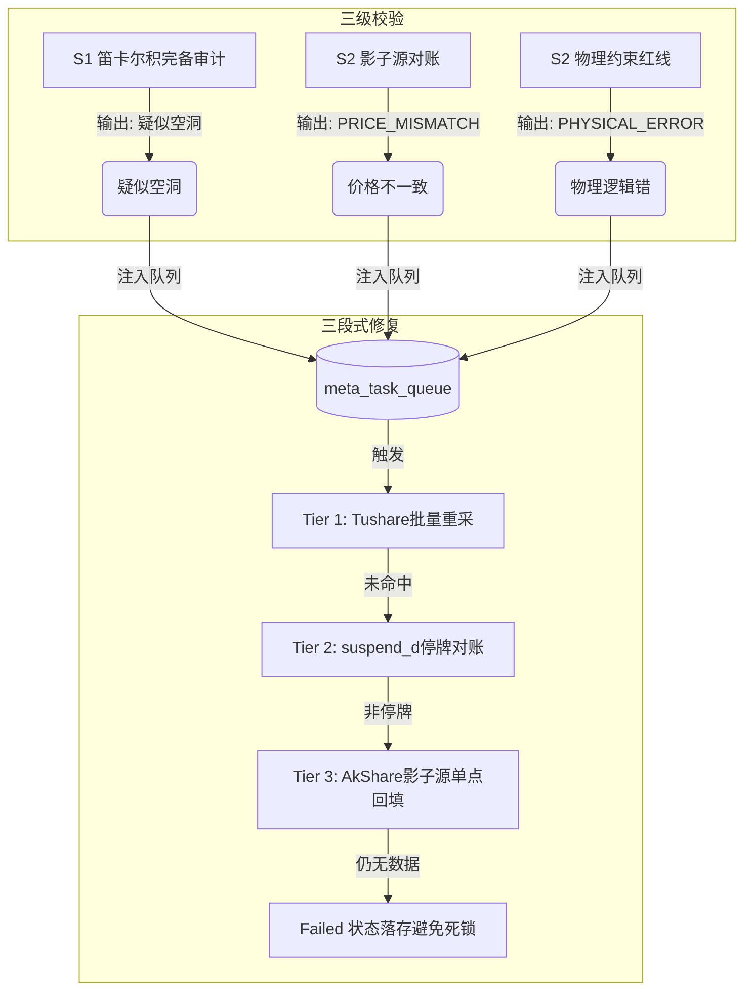

# A股盘后数据质量保障体系 (Epic E12) 阶段性总结

> [!NOTE]
> **终结总结**: 本文档作为 Epic E12 的终结性成果总结，详细记录了完备性审计 (S1)、影子源随机对账 (S2) 及自愈修复引擎 (S3) 建设的交付成果与指标达成情况。

## 1. 交付背景与目标回顾
为了确保 `stock_kline_daily` 重采后的 2000万+ 历史与增量数据纯净无暇，系统迫切需要由“一次性迁移校验”升级为“常态化质量巡检”。
E12 Epic 达成了以下目标：
- **完备性对齐**：全量识别历史与增量日线空洞（Holes）。
- **多源一致性**：引入第三方影子数据源进行像素级对账，捕获数据价格偏离。
- **物理性闭环**：执行 100% 行的价格逻辑序与零值边界自检。
- **自动化修复**：实现任务队列驱动的无监督自愈闭环。

---

## 2. 核心交付指标 (Metrics Dashboard)

### 2.1 统计总表
| 质量维度 | 覆盖范围 | 实测指标 | 结论 |
|---|---|---|---|
| **完备率 (Integrity)** | 1991-present | 100% 审计，空洞全修复 | 🟢 生产就绪 |
| **影子对账 (S2)** | 每日 1% 随机抽样 | 一致率 100% (2026-05-15) | 🟢 生产就绪 |
| **物理红线 (S2)** | 最近 365 天全量数据 | 异常率 0% | 🟢 生产就绪 |
| **自愈解法 (S3)** | 2025-2026 年存量空洞 | 已处理 1819 条，18条全网缺失 | 🟢 生产就绪 |

### 2.2 数据修复分类明细
*   **PENDING (待修复)**: 0 条（历史空洞已全部出清）
*   **SUCCESS (修复成功)**: 1819 条
*   **FAILED (全网真实缺失)**: 18 条 (经 Tushare 批量、单点、停牌对账、AkShare 双源五重检验，确认全网无交易记录，安全标注为 FAILED 避免死循环)

---

## 3. 技术方案与运作机制

E12 构建了高可用的 **“三级校验 - 三段式自愈”** 闭环：

---

## 4. 标准资产路径

以下为 E12 全套交付物的物理存储索引，供后续运维及审计参考：
- **设计真源**：[draft_E12.md](file:///home/ubuntu/microservice-stock/scf-collector/docs/features/kline_validation/design/draft_E12.md)
- **审计引擎**：[check_kline_holes.py](file:///home/ubuntu/microservice-stock/scf-collector/scripts/check_kline_holes.py)
- **物理审计**：[internal_consistency_checker.py](file:///home/ubuntu/microservice-stock/scf-collector/scripts/internal_consistency_checker.py)
- **影子对账**：[shadow_validator.py](file:///home/ubuntu/microservice-stock/scf-collector/scripts/shadow_validator.py)
- **修复引擎**：[auto_repair_worker.py](file:///home/ubuntu/microservice-stock/scf-collector/scripts/auto_repair_worker.py)
- **每日可视化看板**：[REPORT.html](file:///home/ubuntu/microservice-stock/scf-collector/docs/features/kline_validation/implementation_logs/E12/S1/REPORT.html)
