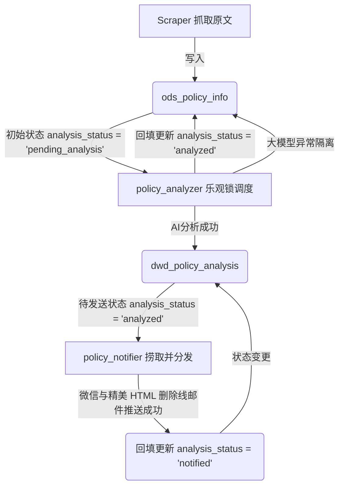

# Epic E14-S2 宏观政策 AI 追踪分析系统异步事件与状态机接口契约 (API.md)

> [!NOTE]
> **API 真源声明**: 宏观政策智能追踪系统全部三大云函数不通过 Web 网关暴露 HTTP 路由，而是采用金融级**事件驱动 (Event-Driven)** 与 **数据库状态机 (Database State Machine)** 进行异步接力运行。本文件定义其事件 Payload 与数据库字段交互协议。

---

## 1. 异步事件驱动接口契约 (Event Payloads)

三个云函数的入口统一为 `main_handler(event, context)`，其触发参数 `event` 定义如下：

### 1.1 政策采集去重云函数 (stock-policy-collector)
- **触发机制**：每 30 分钟定时 Timer 触发
- **事件契约 (Payload)**：
  ```json
  {
    "op": "collect_policies"
  }
  ```
- **同步返回结构**：
  ```json
  {
    "status": "success",
    "new_policies_count": 0,
    "summary": {
      "gov_new": 0,
      "csrc_new": 0,
      "total_new": 0,
      "timestamp": "2026-05-17T20:18:52.120904"
    },
    "request_id": "coll_20260517_201852"
  }
  ```

### 1.2 乐观锁 AI 分析云函数 (stock-policy-analyzer)
- **触发机制**：每 5 分钟定时 Timer 触发
- **事件契约 (Payload)**：
  ```json
  {
    "op": "analyze_policies"
  }
  ```
- **同步返回结构**：
  ```json
  {
    "status": "success",
    "summary": {
      "processed_count": 5,
      "success_count": 5,
      "failed_count": 0,
      "success_ids": [12, 13, 14, 15, 16],
      "failed_ids": [],
      "total_cost_cny": 0.204768,
      "timestamp": "2026-05-17T20:20:37.303658"
    },
    "request_id": "analy_20260517_201857"
  }
  ```

### 1.3 投研分发云函数 (stock-policy-notifier)
- **触发机制**：每 15 分钟定时 Timer 触发
- **事件契约 (Payload)**：
  ```json
  {
    "op": "notify_policies"
  }
  ```
- **同步返回结构**：
  ```json
  {
    "status": "success",
    "summary": {
      "processed_count": 3,
      "notified_count": 3,
      "skipped_count": 0,
      "notified_ids": [12, 13, 14],
      "skipped_ids": [],
      "timestamp": "2026-05-17T20:20:05.922568"
    },
    "request_id": "note_20260517_201957"
  }
  ```

---

## 2. 数据库状态机流转契约 (Database State Machine)

三大云函数通过修改关系型数据库中的行字段状态，实现完全解耦和异步防抖流转：



### 2.1 状态转移矩阵

| 起始状态 | 触发组件 | 变更操作 | 目标状态 | 业务意义 |
|---|---|---|---|---|
| `NULL` | Scraper | `INSERT` | `pending_analysis` | 宏观政策原文被高频抓取去重入库 |
| `pending_analysis` | `policy_analyzer` | `UPDATE` | `analyzed` | LLM 完成 AI 研报措辞比对并成功幂等落库 |
| `pending_analysis` | `policy_analyzer` | `UPDATE` | `failed` | 个例政策发生长文损坏，自动隔离防止死循环堆积 |
| `analyzed` | `policy_notifier` | `UPDATE` | `notified` | 预警富文本微信与 HTML side-by-side 邮件分发成功，彻底去重拦截 |

---
*本接口文档为 A 股宏观政策 AI 追踪分析系统唯一真源契约协议，已向全局网页 Portal 挂接。*
