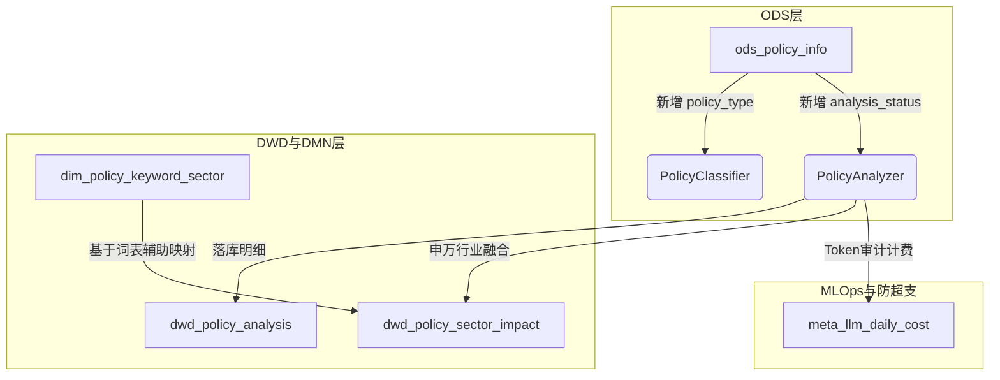

# E14-S2 v2.0 迭代演进评估书 (ITERATION_NOTE)

针对 E14-S2（AI 政策分析与措辞对比）进行从 v1.0 至 v2.0 的全面方案重构与架构升级。本评估书严格对齐 `AGENTS.md` 规范。

---

## 1. 迭代触发动因 (Trigger)

从 v1.0 架构升级至 v2.0 的核心工程触发要素如下：
1. **模型生命周期与高精度计费 (Model Upgrade & Quota Audit)**:
   - 官方已宣布 `deepseek-chat` 接口即将在 2026-07-24 彻底下线。我们被迫在方案中升级至最新的 **DeepSeek V4** 协议群（`deepseek-v4-flash` / `deepseek-v4-pro`）。
   - 原 v1.0 未实现 reasoning tokens、cache_hit、cache_miss 的分级记录，以及日配额防盗防刷逻辑。v2.0 引入高精度 DECIMAL(10,6) 的 `cost_cny` 审计及 ¥5.0 日成本硬限额熔断器。
2. **SCF 超时防御解耦 (Timeout Defense & Function Splitting)**:
   - 原 v1.0 方案为单体云函数同步串联。在宏观政策密集发布日，同步串联调用 LLM 势必超过 SCF 900 秒的硬超时限制，导致采集逻辑中断。
   - v2.0 升级为 `policy_collector`（采集）、`policy_analyzer`（分析加锁批处理）与 `policy_notifier`（预警通知）的 **三函数物理隔离与解耦**，借助 MySQL 行级锁与 analysis_status 状态流转进行接力。
3. **对比基准错乱纠偏 (Wording Baseline Precision)**:
   - 原 v1.0 的对比基准仅通过发布日期反推“上一期政策”，容易造成将“人行货政报告”与“LPR报价公告”混同对比的业务逻辑错误。
   - v2.0 强制前置执行 `policy_type` 正则/Flash 分类，实现 **“仅在 ts_code 和 policy_type 均相同”** 的前提下查找上一期基准政策做双向措辞比对，保证金融分析结果的精准性。
4. **思维链深度思考与 JSON 协议冲突防御 (Thinking Token & Robust Parsing)**:
   - 官方 DeepSeek V4 启用 thinking 深度思考流时，协议层**无法配置** JSON 输出限制（`json_object`），容易导致 API 返回非法 Markdown 标记引起系统崩溃。
   - v2.0 升级了大模型客户端的 JSON 提纯正则抽取模块，对 pro 档位强力防崩。

---

## 2. 影响面评估 (Impact Map)

本次迭代覆盖的模块范围极广，但均严格遵循腾讯云服务物理边界。

### 2.1 物理 Schema 变更
1. **ods_policy_info**: `ALTER TABLE` 新增 `policy_type` (政策分类) 与 `analysis_status` (分析状态) 字段及索引。
2. **dwd_policy_analysis**: 新增表。存储 AI 三句话摘要、重要评级、措辞强度差异、MLOps 统计（模型、Prompt版本）、精准 Token 审计与 6 位精度实际消耗成本。
3. **meta_llm_daily_cost**: 新增表。天级成本归口审计，防刷防爆。
4. **dwd_policy_sector_impact**: 新增表。政策对申万二级板块影响的扁平明细（positive / negative）。
5. **dim_policy_keyword_sector**: 新增表。保存申万行业分类关键词种子映射表，用于和 AI 混合推演板块。

### 2.2 代码与依赖变更
1. **requirements.txt**: 引入 `openai>=1.30.0` 作为官方标准 SDK。
2. **llm_client.py**: 全新编写。支持异步 Chat、故障 3 次指数退避重试、多模态分发，具备 Quota 限额主动阻断。
3. **policy_analyzer.py**: 重构为面向高并发队列的版本。实现 `find_previous_policy` 与正则/LLM 行业融合匹配。
4. **云函数重构**: 废弃 `policy_monitor/index.py`，物理拆分为三个独立云函数工程目录。

---

## 3. 回归验证清单 (Regression AC)

为了保障升级到 v2.0 后不影响已有 E14-S1 的历史及存量业务：

- **[ ] AC-REG-01 (采集链无感升级)**:
  - **测试场景**: 启动 `policy_collector` 云函数抓取新数据。
  - **预期效果**: 新插入的数据可以正常写入 `ods_policy_info`，且 `analysis_status` 字段默认填充为 `'pending_analysis'`，原有爬虫采集逻辑与反爬绕过不受任何影响。
- **[ ] AC-REG-02 (通知服务兼容)**:
  - **测试场景**: 推送一条 AI 分析完结政策。
  - **预期效果**: 邮件 HTML 排版样式在 Staging 邮箱内能无变形渲染，原有微信通知可正确推送 600 字文本简报，且推送完毕后状态被物理改为 `'notified'`。
- **[ ] AC-REG-03 (Token 配额限额熔断)**:
  - **测试场景**: 模拟数据库日成本达 ¥4.99，再次触发 Analyzer AI 分析调用。
  - **预期效果**: 客户端主动抛出 `QuotaExceededError` 安全阻断请求，保障 Token 费用不超支。
