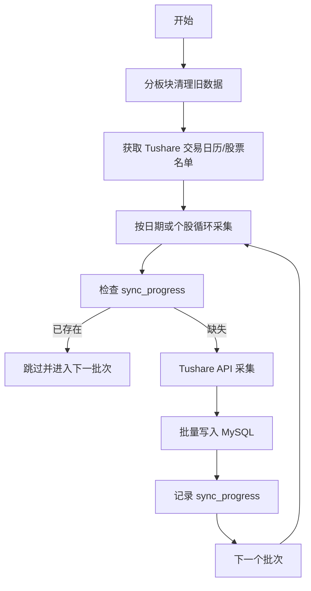

# Epic E13: Tushare 全业务线迁移：K线、财务、指标与指数 (全量回填版)

> **状态**: 已评审 / 持续更新中
> **最后更新**: 2026-05-17
> **版本**: v2.0 (全业务线覆盖)

---

## 背景与现状
由于 BaoStock 数据源存在严重的「隐性复权」污染，导致 `stock_kline_daily` 历史数据不可靠。评审决定直接清空现有数据，改用 Tushare 作为唯一真源进行全量回填。目前日 K 线部分的采集源已成功清空并采用单线程回填，实现了高水准的“不复权”行情覆盖。

随着 K 线质量保障体系（E12）的成功闭环，系统已具备处理大规模数据异常的能力。为了统一数据口径并提升计算效率，本项目决定将核心数据源（包括财务表、估值指标与指数行情）全面向 Tushare 迁移。

本次迁移要求严格遵循「云端服务器运行（非 SCF）」、「单线程采集」及「不复权口径」原则。

---

## 设计方案
迁移方案采用「分板块逐步清空 + 单线程全量覆盖」策略。

### 核心原则
1. **物理隔离**: 所有同步逻辑部署于腾讯云服务器（Tencent Cloud Environment），利用其持久化存储和无限制运行时间的特性，**严禁在 SCF 上运行**。
2. **单线程策略**: 为了应对 Tushare 2000 分的频次限制，采用串行请求模式，通过延迟控制（Throttling）确保不触发熔断。
3. **采集口径**: 
    - **市场范围**: 所有 A 股及主流指数。
    - **起始时间**: Tushare 交易日历记录的所有历史日期。
    - **数据类型**: 严格不复权（Raw K-line），财务报表以官方披露为准，估值数据以交易日收盘指标为准。
    - **成交量标准**: 遵循 Tushare 官方标准。
4. **进度审计**: 依赖 `sync_progress` 表记录成功同步的日期或股票，支持进程重启后的自动断点续传。

---

## 风险评估与里程碑

### 风险评估
- **Tushare 频次限制**: 设置单线程延时，每分钟请求不超过规定阈值（对应 2000 积分权限）。 (影响: 中, 概率: 高)
- **接口流量控制**: 两融、财务比率等重度接口容易触发流控，建议针对财务报表按季度/个股拆分拉取，单次休眠不少于 1.5s。 (影响: 高, 概率: 中)

### 里程碑
- **M1: 存量K线清理与回填**: 2026-05-16 - 已完成 (K线部分 Tushare 单线程全量回填与 E12 对账)
- **M2: 指数与估值指标迁移**: 2026-05-20 - 迁移主要指数日线与 `daily_basic` 估值表
- **M3: 财务报表三表迁移**: 2026-05-25 - 完成资产负债表、利润表、现金流量表的全量 Tushare 对接

---

## 迁移 Story 规划

### E13-S1: K线存量清理与环境初始化
**角色**: DB Auditor
**希望**: 清空现有 stock_kline_daily 并准备同步进度表
**价值**: 为 Tushare 真源数据提供纯净的存储空间

#### 任务
- [x] E13-S1-T1: 执行 `TRUNCATE TABLE stock_kline_daily`
- [x] E13-S1-T2: 初始化 `sync_progress` 表中全量同步任务的状态记录

#### 验收标准 (AC)
- **AC1: 清空校验**: Given 执行 TRUNCATE 命令后, When 查询 stock_kline_daily 行数, Then 结果必须为 0，且自增主键重置。

---

### E13-S2: K线单线程断点同步引擎
**角色**: Backend Engineer
**希望**: 按交易日顺序单线程采集全市场 K 线
**价值**: 稳定、安全地完成全量回填，不触发 Tushare 限流

#### 任务
- [x] E13-S2-T1: 开发按日循环采集脚本，对接 Tushare `daily` 接口
- [x] E13-S2-T2: 实现基于 `sync_progress` 的断点续传逻辑

#### 验收标准 (AC)
- **AC1: 单线程频次校验**: Given Tushare 2000 分权限（120积分/次）, When 采集进程运行时, Then 每分钟请求次数通过 `time.sleep` 严格控制在安全范围内。
- **AC2: 断点恢复校验**: Given 同步到 2015-01-01 时进程被手动终止, When 再次启动脚本时, Then 系统自动从 2015-01-01 之后的一个交易日继续，不重复采集。

---

### E13-S3: 进度可视化与健康度监控
**角色**: Backend Engineer
**希望**: 实时查看同步进度与预估完成时间
**价值**: 掌控长时间跨度任务的运行状态

#### 任务
- [x] E13-S3-T1: 在 CLI 界面实时刷新同步进度（当前日期/总日期）
- [x] E13-S3-T2: 实现异常自动重试（3次）并在失败后发送告警通知

#### 验收标准 (AC)
- **AC1: 进度输出校验**: Given 采集脚本运行时, When 观察控制台输出, Then 必须包含「当前同步日期」、「已完成百分比」及「已入库行数」。

---

### E13-S4: 财务三表与关键比率迁移 (待实施)
**角色**: Data Steward
**希望**: 将历史财务报表（季报/年报）全面切换至 Tushare 源
**价值**: 提供标准化的财报底座，支持基本面分析

#### 任务
- [ ] E13-S4-T1: 开发 `income_sheet` (利润表) 全量同步逻辑。
- [ ] E13-S4-T2: 开发 `balancesheet` (资产负债表) 全量同步逻辑。
- [ ] E13-S4-T3: 开发 `cashflow` (现金流量表) 全量同步逻辑。
- [ ] E13-S4-T4: 字段口齐：确保金额单位统一为“元”，处理合并与单体报表。

#### 验收标准 (AC)
- **AC1: 披露日对齐**: Given 某一股票财报, When 检查发布日期时, Then 必须区分 `ann_date` (公告日) 与 `end_date` (报告期末)，避免未来函数污染。

---

### E13-S5: 每日估值指标与融资融券 (待实施)
**角色**: Quantitative Researcher
**希望**: 每日盘后获取 PE、PB、PS、换手率等估值数据
**价值**: 选股策略的核心输入参数

#### 任务
- [ ] E13-S5-T1: 对接 Tushare `daily_basic` 接口，回填 2010 年至今的估值数据。
- [ ] E13-S5-T2: 对接 `margin_detail` 接口，同步两融历史数据。
- [ ] E13-S5-T3: 建立 `daily_basic` 与 `kline_daily` 的外键审计与物理红线自检规则。

#### 验收标准 (AC)
- **AC1: 换手率精度**: Given 换手率数据, Then 必须统一为小数格式（如 1.5% 存储为 0.015）。

---

### E13-S6: 指数行情与申万行业体系 (待实施)
**角色**: Architect
**希望**: 规范指数行情及申万行业成员数据源
**价值**: 支撑行业轮动分析与基准对比

#### 任务
- [ ] E13-S6-T1: 迁移主要指数（上证、深证、沪深300、中证500）的日线行情。
- [ ] E13-S6-T2: 更新申万行业（SW）三级分类成员映射表。
- [ ] E13-S6-T3: 维护指数权重（Index Weight）历史变动记录。

#### 验收标准 (AC)
- **AC1: 行业覆盖率**: Given 最新上市个股, When 运行行业匹配脚本时, Then 申万行业覆盖率必须达到 100%。

---

## 变更记录
| 日期 | 版本 | 变更说明 |
|---|---|---|
| 2026-05-17 | v2.0 | **重大升级**: 增加财务、指标、指数全业务线迁移 Story。 |
| 2026-05-16 | v1.1 | **评审后更新**: 明确服务器单线程运行，禁止在 SCF 运行。 |
| 2026-05-16 | v1.0 | 初版方案设计 |
