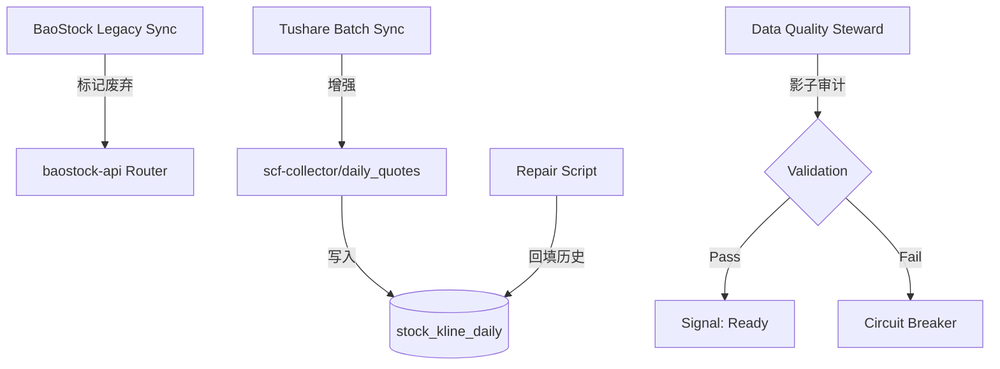

# Epic E13: 全市场日 K 线采集源迁移：从 BaoStock 切换至 Tushare

> **状态**: 草案 / 待评审
> **最后更新**: 2026-05-16
> **版本**: v1.0

---

## 背景与现状
当前系统主要依赖 BaoStock 进行全市场 K 线同步。然而，审计发现 BaoStock 提供的日线数据在除权除息日附近存在「隐性复权」现象，导致原始价格（Raw Price）存储不纯净，严重干扰了本地复权因子的计算与前复权视图的准确性。

Tushare 作为 A 股数据的真源（P0），提供严格的不复权日线接口 (`daily`) 和每日复权因子接口 (`adj_factor`)，符合项目「存储原始态，动态算逻辑」的核心原则。

---

## 设计方案
迁移方案采用「平滑切换 + 历史覆盖」策略。

---

## 风险评估与里程碑

### 风险评估
- **Tushare 流量限制**: 使用 asyncio.sleep 配合 5 级指数退避重试，分批次获取。 (影响: 中, 概率: 高)
- **历史数据覆盖冲突**: 先执行全量备份，使用 trade_date + ts_code 唯一键 Upsert。 (影响: 高, 概率: 低)

### 里程碑
- **M1: 引擎增强**: 2026-05-18 - 交付支持历史范围同步的 TushareCollector
- **M2: 历史修复**: 2026-05-20 - 交付 2010-2026 历史数据覆盖完成报告
- **M3: 线上切换**: 2026-05-22 - 全面关停 BaoStock 写入路由

---

## E13 全市场日 K 线采集源迁移

将 K 线真源由 BaoStock 迁移至 Tushare，修复历史复权数据污染。

### E13-S1: Tushare 历史同步引擎增强
**角色**: scf-collector
**希望**: 支持按日期范围分批次抓取全市场 K 线
**价值**: 确保存储的是不复权的纯净原始价格

#### 任务
- [ ] E13-S1-T1: 扩展 TushareCollector 增加 fetch_historical_daily_kline 方法
- [ ] E13-S1-T2: 实现按月分片（Monthly Chunking）的采集调度逻辑

#### 验收标准 (AC)
- **AC1: 单位归一化校验**: Given Tushare 原始数据（amount 以千元计，vol 以手计）, When 执行同步任务, Then 入库数据 amount 自动乘以 1000（单位元），volume 保持原始手（符合 TABLES_INDEX 规范）
- **AC2: 断点续传校验**: Given 同步任务在处理到某月时因网络中断, When 重新启动任务, Then 系统能自动识别已完成月份，从中断点继续采集

---

### E13-S2: 存量污染数据清洗与回填
**角色**: Data Quality Steward
**希望**: 将旧有 BaoStock 来源的记录识别并替换为 Tushare 数据
**价值**: 消除历史回测中的价格漂移风险

#### 任务
- [ ] E13-S2-T1: 编写 SQL 审计脚本，标记非 Tushare 来源或疑似复权的记录
- [ ] E13-S2-T2: 开发历史回填 CLI 工具，执行 Replace 覆盖逻辑

#### 验收标准 (AC)
- **AC1: 覆盖范围校验**: Given 2010-01-01 至 2026-05-15 期间的数据, When 执行修复任务后, Then 所有记录的来源标记应更新为 Tushare，且同一交易日记录数与全市场快照一致

---

### E13-S3: BaoStock 路由降级与采集切换
**角色**: Backend Engineer
**希望**: 关停旧有的写入接口并更新生产环境触发器
**价值**: 防止数据源再次回潮

#### 任务
- [ ] E13-S3-T1: 在 baostock-api 中标记 /sync/full 为 deprecated 并增加只读拦截
- [ ] E13-S3-T2: 更新 SCF 环境变量，将 daily_quotes 的主源固定为 tushare

#### 验收标准 (AC)
- **AC1: 写入封锁校验**: Given 尝试调用 baostock-api 的同步接口, When 接口被调用时, Then 返回 403 Forbidden 或 410 Gone，且数据库中无新记录插入

---

### E13-S4: 影子审计与精度核验
**角色**: Data Quality Steward
**希望**: 对比本地「Raw * Factor」计算结果与 Tushare 官方前复权价
**价值**: 确保数据链路 100% 准确

#### 任务
- [ ] E13-S4-T1: 实现 validate_kline_accuracy.py 核验脚本
- [ ] E13-S4-T2: 在每日采集结束后自动触发精度报告

#### 验收标准 (AC)
- **AC1: 复权精度校验**: Given 随机 10 只样本股的历史成交数据, When 计算 (Local Raw * Local Factor) 与 Tushare Official Adj Price 差值时, Then 相对误差必须小于 0.0001，否则触发邮件告警
