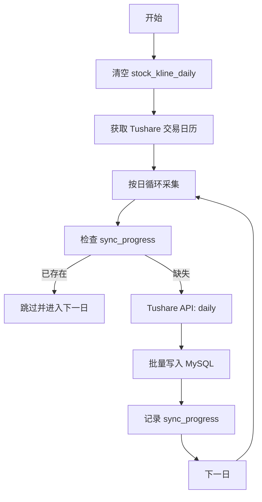

# Epic E13: 全市场日 K 线采集源迁移：从 BaoStock 切换至 Tushare (全量回填版)

> **状态**: 已评审 / 待实施
> **最后更新**: 2026-05-16
> **版本**: v1.1

---

## 背景与现状
由于 BaoStock 数据源存在严重的「隐性复权」污染，导致 `stock_kline_daily` 历史数据不可靠。评审决定直接清空现有数据，改用 Tushare 作为唯一真源进行全量回填。

本次迁移要求严格遵循「云端服务器运行（非 SCF）」、「单线程采集」及「不复权口径」原则。

---

## 设计方案
迁移方案采用「环境清空 + 单线程全量覆盖」策略。

### 核心原则
1. **物理隔离**: 所有同步逻辑部署于腾讯云服务器（Tencent Cloud Environment），利用其持久化存储和无限制运行时间的特性，**严禁在 SCF 上运行**。
2. **单线程策略**: 为了应对 Tushare 2000 分的频次限制，采用串行请求模式，通过延迟控制（Throttling）确保不触发熔断。
3. **采集口径**: 
    - **市场范围**: 所有 A 股。
    - **起始时间**: Tushare 交易日历记录的所有历史日期。
    - **数据类型**: 严格不复权（Raw K-line）。
    - **成交量标准**: 遵循 Tushare 官方标准。
4. **进度审计**: 依赖 `sync_progress` 表记录成功同步的日期，支持进程重启后的自动断点续传。

---

## 风险评估与里程碑

### 风险评估
- **Tushare 频次限制**: 设置单线程延时，每分钟请求不超过规定阈值（对应 2000 积分权限）。 (影响: 中, 概率: 高)
- **磁盘空间压力**: 全量 A 股 K 线约 1500w+ 行，MySQL 存储约 5-8GB，云服务器磁盘充足。 (影响: 低, 概率: 低)

### 里程碑
- **M1: 环境准备**: 2026-05-16 - 数据表清空与采集脚本初始化
- **M2: 历史同步**: 2026-05-20 - 1990 至今全量数据回填完成

---

## E13 全市场日 K 线采集源迁移

在云端服务器执行单线程全量 K 线回填，确保数据纯净性与完整性。

### E13-S1: 存量清理与环境初始化
**角色**: DB Auditor
**希望**: 清空现有 stock_kline_daily 并准备同步进度表
**价值**: 为 Tushare 真源数据提供纯净的存储空间

#### 任务
- [ ] E13-S1-T1: 执行 `TRUNCATE TABLE stock_kline_daily`
- [ ] E13-S1-T2: 初始化 `sync_progress` 表中全量同步任务的状态记录

#### 验收标准 (AC)
- **AC1: 清空校验**: Given 执行 TRUNCATE 命令后, When 查询 stock_kline_daily 行数, Then 结果必须为 0，且自增主键重置。

---

### E13-S2: 单线程断点同步引擎
**角色**: Backend Engineer
**希望**: 按交易日顺序单线程采集全市场 K 线
**价值**: 稳定、安全地完成全量回填，不触发 Tushare 限流

#### 任务
- [ ] E13-S2-T1: 开发按日循环采集脚本，对接 Tushare `daily` 接口
- [ ] E13-S2-T2: 实现基于 `sync_progress` 的断点续传逻辑

#### 验收标准 (AC)
- **AC1: 单线程频次校验**: Given Tushare 2000 分权限（120积分/次）, When 采集进程运行时, Then 每分钟请求次数通过 `time.sleep` 严格控制在安全范围内。
- **AC2: 断点恢复校验**: Given 同步到 2015-01-01 时进程被手动终止, When 再次启动脚本时, Then 系统自动从 2015-01-01 之后的一个交易日继续，不重复采集。

---

### E13-S3: 进度可视化与健康度监控
**角色**: Backend Engineer
**希望**: 实时查看同步进度与预估完成时间
**价值**: 掌控长时间跨度任务的运行状态

#### 任务
- [ ] E13-S3-T1: 在 CLI 界面实时刷新同步进度（当前日期/总日期）
- [ ] E13-S3-T2: 实现异常自动重试（3次）并在失败后发送告警通知

#### 验收标准 (AC)
- **AC1: 进度输出校验**: Given 采集脚本运行时, When 观察控制台输出, Then 必须包含「当前同步日期」、「已完成百分比」及「已入库行数」。

---

## 变更记录
| 日期 | 版本 | 变更说明 |
|---|---|---|
| 2026-05-16 | v1.0 | 初版方案设计 |
| 2026-05-16 | v1.1 | **评审后更新**: 明确禁止在 SCF 运行，改为服务器单线程回填；要求清空旧数据；排除复权因子下载。 |

---
> **评审批注 (2026-05-16)**:
> 1、stock_kline_daily 全市场全量k线数据下载功能只能在腾讯云服务器进行，禁止再SCF上运行。
> 2、定义市场范围：所有A股，定义起始时间：tushare交易日历的所有日期，明确只采集k线不复权数据，明确成交量遵循Tushare现有标准。
> 3、明确采集方式为单线程采集，根据tushare接口特点选择是按日期下载，支持断点下载，支持查看采集进度。
> 4、stock_kline_daily现在数据直接清空。
> 5、本次不包含复权因子数据下载。
> 6、tushare积分2000分，考虑数据频率限制。
