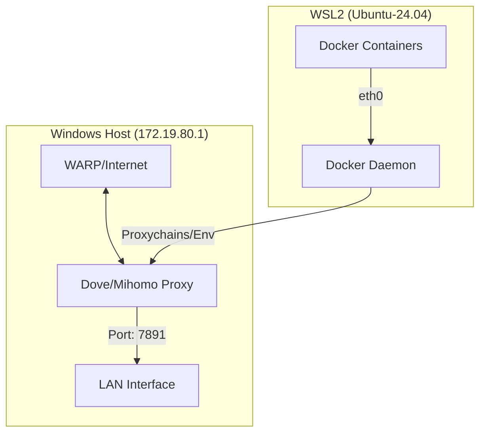

# WSL2 + Docker 智能代理配置指南

本指南记录了在 Windows 宿主机环境下，如何配置 WSL2 及其内部的 Docker 容器通过宿主机代理（如 Dove/Mihomo）实现透明上网的完整方案。

## 1. 🏗️ 系统架构



## 2. ⚙️ Windows 代理端设置

为了让 WSL2 能够访问宿主机的代理，必须开启 **局域网访问**。

*   **软件**: DOVE / Mihomo / Clash
*   **代理端口**: `7891` (Mixed Port)
*   **关键配置**:
    *   `allow-lan`: `true` (允许局域网连接)
    *   `bind-address`: `*` (绑定所有网卡)
*   **防火墙**: 确保 Windows 防火墙允许该代理程序通过公用/专用网络。

## 3. 🐧 WSL2 环境配置

### 3.1 获取宿主机 IP
WSL2 通过虚拟网桥连接，宿主机的 IP 随启动可能变化。可以通过以下命令动态获取：
```bash
# 获取宿主机 IP
export HOST_IP=$(ip route show | grep default | awk '{print $3}')
```

### 3.2 配置 Docker 守护进程代理
为了让 `docker pull` 能够正常工作，需要为 Docker Daemon 配置系统级代理。

1.  **创建配置目录**:
    ```bash
    sudo mkdir -p /etc/systemd/system/docker.service.d
    ```

2.  **创建配置文件** `/etc/systemd/system/docker.service.d/http-proxy.conf`:
    ```ini
    [Service]
    Environment="HTTP_PROXY=socks5h://172.19.80.1:7891"
    Environment="HTTPS_PROXY=socks5h://172.19.80.1:7891"
    Environment="NO_PROXY=localhost,127.0.0.1,::1,192.168.0.0/16,10.0.0.0/8,172.16.0.0/12,*.local"
    ```
    *注意：推荐使用 `socks5h` 以确保 DNS 解析也在代理端完成。*

3.  **重启 Docker 服务**:
    ```bash
    sudo systemctl daemon-reload
    sudo systemctl restart docker
    ```

## 4. 🚀 验证与使用

### 4.1 验证 Docker 拉取
```bash
docker pull alpine
```

### 4.2 运行容器时使用代理
在运行容器时，需要手动传入环境变量：
```bash
docker run --rm \
    -e http_proxy=http://172.19.80.1:7891 \
    -e https_proxy=http://172.19.80.1:7891 \
    curlimages/curl curl -I https://www.google.com
```

## 5. 🛠️ 常见问题排查

*   **DNS 故障**: 如果 WSL 无法解析任何域名，请检查 `/etc/resolv.conf`。
*   **连接被拒绝**: 检查 Windows 代理是否确实开启了 `Allow LAN`，并确认宿主机 IP 是否正确（使用 `ip route` 确认）。
*   **SSL 超时**: 可能是代理线路不稳定或宿主机防火墙拦截了特定端口的握手。

---

**最后更新**: 2026-05-12
